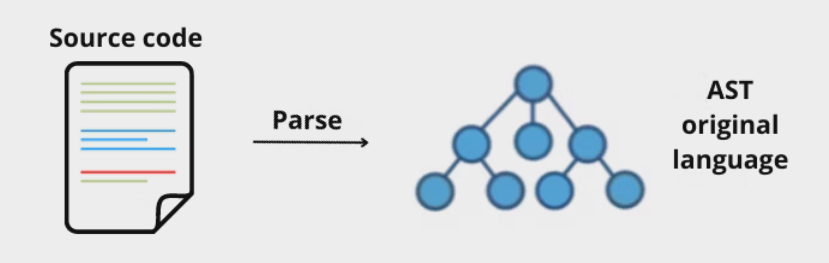
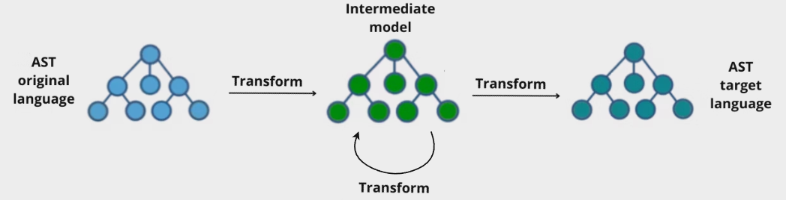
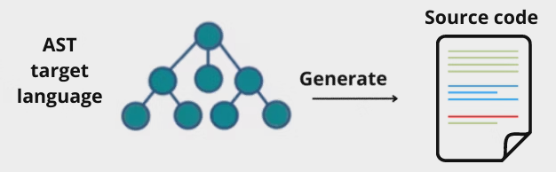

<!-- _class: topic -->
# Babel
#### Khai-Yiu Soh

---
### Overview

+ Introduction to babel
+ Babel setup / configurations
+ Basic custom plugin implementation
+ Hands-on: creating custom plugin under test
---
### What is Babel?

+ Babel is a toolchain mainly for converting ECMAScript 2015+ code into backwards compatible JavaScript
+ Features: Transform syntax, polyfill, custom plugins

```JavaScript
// Babel input: ES2015 arrow function
[1, 2, 3].map(n => n + 1);

// Babel output: ES5 equivalent
[1, 2, 3].map(function(n) {
  return n + 1;
});
```

<!-- Babel is a toolchain primarily for converting ES6+ code into ES5 code to ensure modern JavaScript features are backwards compatible in older browsers. So, as a basic example, arrow functions are a feature of ES6, but it's essentially just syntactic sugar for a regular function so Babel can transform the syntax but achieve the same functionality. With custom plugins, it can also be a useful refactoring tool if you need to apply some changes throughout your codebase. It might be easier to use a regex for a search and replace for small tasks, but for larger tasks, using a plugin, you have the context of the different code elements and the reliability of applying complex transformations whereas regex is just limited to simple text substitutions. And this custom plugin can be reuseable and integrated with your current build process easily. -->

---
### Brief History

+ Created in September, 2014
+ Originally named "6to5"
+ Turned into Babel, becoming a tooling platform for developers
+ Still serves as a modern JS transpiler

<!-- Babel was created in September 2014 and it was originally named 6to5. Just like the name suggests, it was designed to transpile ES6 code into ES5 code. In a short time it gained huge popularity and began to expand its scope beyond just transpiling, so they renamed to Babel and became a toolchain where developers can take advantage of their simple API to develop different JS tools. -->
---
### Why use Babel?

+ ECMA has released yearly updates to JavaScript
+ Babel transpiler ensures new features of JS can be used regardless of browser support

<!-- Since ES6, which was released in 2015, there's been a new update to JavaScript every year. This means browsers will frequently need to integrate changes to support new features which isn't guaranteed or they take a long time to do so. However, Babel will always keep up to date with the new standards. Therefore using a Babel transpiler ensures developers can use new features of JavaScript without having to worry about the platform their customers use. Today, Babel still serves as a modern JS transpiler supporting the latest features. -->

---
### How does it work? (pt. 1)

1. Babel parses the source code into an AST
  
  + @babel/parser



<!-- Babel starts with parsing your source code into an AST, using the helper package babel/parser to do so. An AST is just a structured representation of your code reflecting its syntax and structure. So under the hood it's performing lexical analysis (converting code to tokens) and then syntactic analysis or parsing (converting tokens into AST) to abstract all the semantic details -->
---
<style scoped>
  .code-block-normal {
    font-size: 20px;
  }
</style>
### Example

<div class="container">
<div class="code-block-normal" style="font-size: 30px">

```JavaScript
function square(n) {
  return n * n;
}
```
</div>
<div class="code-block-normal" style="font-size:19px">

```JSON
{
  "type": "FunctionDeclaration",
  "id": {
    "type": "Identifier",
    "name": "square"
  },
  "params": [
    {
      "type": "Identifier",
      "name": "n"
    }
  ],
  "body": {
    "type": "BlockStatement",
    "body": [
      {
        "type": "ReturnStatement",
        "argument": {
          "type": "BinaryExpression",
          "left": {
            "type": "Identifier",
            "name": "n"
          },
          "operator": "*",
          "right": {
            "type": "Identifier",
            "name": "n"
          }
        }
      }
    ]
  }
}
```
</div>
</div>

<!-- Here's a simple square function and it's representation as a sub-tree in the AST. You might describe it by taking the important features of this function. So in this case, we need to know we are dealing with a function type, it's name which is square, the parameters the function takes in, its exports represented by the ReturnStatement node and in other cases, there could be multiple statements within the function body which is why body is an array. And each object with a type property you see is considered a node by Babel, which will be important later on for applying specific transformations based off the node type. -->
---
### How does it work? (pt. 2)

2. Generate a new AST by applying a set of transformations to the original AST

  + @babel/traverse



<!-- Babel applies our specified plugins sequentially to the AST, the module @babel/traverse is used to traverse the AST, then visit and potentially transform different nodes depending on the logic. The plugins that apply the transformation make use of the visitor pattern, which is used here to run a transformation function on a corresponding node when that node is visited. This'll probably more clearer later on when writing our own plugin. And modification of the AST is done in-place so there's less overhead. -->
---
### How does it work? (pt. 3)

3. Convert the new AST into transpiled source code 

  + @babel/generator



<!-- After applying all transformations, Babel generates the transpiled code from the modified AST. -->
---
<style scoped>
  code {
    font-size: 25px;
  }
</style>
### Setting up Babel

+ Installation: `npm install --save-dev @babel/core @babel/cli @babel/preset-env`
+ `@babel/core` - transpiling tools
+ `@babel/cli` - CLI for using babel in terminal or scripts
+ `@babel/preset-env` preset ensuring new JS features are backwards-compatible

<!-- This is a pretty standard setup for installing babel, babel core provides the core functionality for transpiling your code, such as parsing, applying transformations and generating code. Babel cli provides a command line interface for running babel and preset env is a preset for determining what transformations take place which we'll get into a bit later -->
---
### Running babel

+ `babel <target> -d <output_target>`

+ `--out-file`, `--presets`, `--plugins`, `--watch`


<!-- To run babel, you can specify a target directory or file and the output for the transpiled code. Then there are some flags you can add, so out-file will output all input files into a single file. You can specify the presets and plugins you want to apply in the command but it's better to setup in a configuration file. And if watch is enabled it automatically transpiles files when they change, that can be useful for testing if you want to ensure your source implementation and transpiled implementation provide the same functionality, and you won't have to explicitly run the babel command to maintain an updated build after each change. -->

---
### Configuration files

+ Project-wide: `babel.config.json` or `babel.config.js`
+ File-relative: `.babelrc.json` or `.babelrc.js`
  
<!-- You can specify your Babel configurations in the babel.config.json file located at the root directory, this will apply to the whole project. If you want to apply the configuration only to a subset of directories or files, use a .babelrc.json file in the relative location. You can also use JavaScript format instead of JSON if your configuration is dynamic, then you can apply different settings based off logic. You'd just need to export a function which returns an object of all the settings you'd want. -->
---
### Babel plugins

+ Plugins are modules which apply code transformations
+ Order matters, apply from left to right

```JSON
{
  "plugins": [
    "@babel/plugin-transform-block-scoping"
    ["@babel/plugin-transform-arrow-functions", { "spec": true }],
  ]
}
```

<!-- Plugins are just modules which apply code transformations. The order you specify multiple plugins is also important. So for example, if one plugin converts ES6 features to ES5, then the following plugin expects ES6 syntax to perform a transformation, it might lead to unexpected results. So for plugins, they're applied from left to right. Then, Babel automatically resolves plugins that are on npm by looking in the node modules directory. Otherwise you can specify the file path to a custom plugin. And there are two formats as you can see for adding plugins, the plugins property itself is an array but if you want to specify options for a certain plugin, that needs to be wrapped in another array and provided an object. -->
---
### Babel presets

+ Presets are a set of plugins
+ Apply from right to left, plugins run before presets

```JSON
{
  "presets": ["@babel/preset-env", "@babel/preset-typescript"]
}
```

<!-- Presets are just a set of plugins tailored for a specific work environment, it saves you the hassle of configuring multiple specific plugins. And unlike plugins, they're applied right to left instead. If both presets and plugins are specified, the plugins are applied first. Similarly to plugins, in the babel configuration file, you can provide the name of the preset and Babel will check node_modules to see if it's installed. You can also provide the path to a custom preset if you've created one. And similar to plugins, you can also provide options to a plugin but it also needs to be within another array. -->
---
### Common presets

+ **@babel/preset-env**
  
  + Deprecated: **@babel/preset-es2015**, **2016**, **2017**
+ **@babel/preset-typescript**
+ **@babel/preset-react**

<!-- These are some of the more common presets, preset-env is a smart preset which can dynamically determine which plugins and polyfills are needed for transpiling based off the target environment. So it saves you time by not needing to micromanage transforms and reduce your bundle size. Before this, you had individual presets for each version of JavaScript but they're deprecated now in favour of using preset-env. Then you got the typescript and react presets as well which well, provide support for typescript and react. -->
---
<style scoped>
  code {
    font-size: 25px;
  }
</style>
### Target options

+ For `@babel/preset-env`

```JSON
// https://github.com/browserslist/browserslist

{
  "targets": "> 0.25%, not dead"
}
```
```JSON
{
  "targets": {
    "chrome": "58",
    "ie": "11", 
    "firefox": "90" 
  }
}
```

<!-- One of the options for preset-env is target, where you can explicitly describe the target browser environment you want to support. The first format provides a browserslist-compatible query to specify target browsers. In this case, it tells Babel to transpile the code so it's compatible in browsers with more than 0.25% global usage and to ignore browsers that are no longer maintained. The comment links to a repo with more information on the queries you can form. The second format is an object of minimum environment versions to support. If no target is provided, then Babel assumes you target the oldest browsers possible and will transform your code to be ES5 compatible. -->
---
### Custom presets

```JSON
// src/custom-preset.js

module.exports = () => ({
  "presets": ["presetA"],
  "plugins": ["pluginA"],
  ...
})
```
```JSON
// babel.config.json

{
  "presets": ["./src/custom-preset.js"]
}
```

<!-- And like plugins, you can also create custom presets. You need to export a configuration object specifying the plugins to use, and you can even add other presets and options if you want -->
---
### Polyfills

+ Polyfills are pieces of code used to add missing functionality
+ Some modern features aren't available in older versions
+ **@babel/polyfill** is deprecated
+ **core-js** to import polyfills

<!-- Polyfills add missing functionality in environments that lack support for certain modern JavaScript features. Since some relatively newer features like Promises and certain array methods weren't available in older versions, that functionality needs to be provided since transpiling it won't make that feature available in environments that don't natively support it. So overall, Babel provides support across different environments through a combination of transpilation, which deals with syntax changes, and polyfilling, which provides missing functionality for features. As of the latest version of Babel, the babel/polyfill package has been deprecated in favour of using the corejs library to include polyfills you only need which can reduce bundle size. -->

---
### Using polyfills

+ `npm install core-js`

```JSON
{
  "presets": [
    [
      "@babel/preset-env",
      {
        "useBuiltIns": "usage",
        "corejs": 3
      }
    ]
  ]
}
```
<!-- We mentioned before preset-env can dynamically choose which plugins to use, that same concept can be applied to polyfills. So to import polyfills from corejs, you need to install the package first. Then you can configure your babel.json to enable options for preset-env to specify useBuiltIns which enables the preset to add direct references to the corejs modules, and the corejs version itself. Without explicitly setting these, polyfills won't be imported into your transpiled code. -->
---
### Some other configuration options

+ **ignore**: Files / directories to be excluded
+ **comments**: Include comments in output (**true**, **false**)
+ **compact**: Omit newlines and whitespace (**auto**, **false**, **true**)
+ **minified**: Applies **compact**, shortens some statements / expressions

<!-- "ignore" specifies files / directories to not be transpiled. "comments" is a boolean option with the default being true, it just determines whether the output contains any comments. In the AST, the comments will appear as properties on nodes but they aren't treated as nodes since the AST is only concerned with semantic details during parsing. "compact" removes newlines and whitespace to reduce the size of the output. If you set the value to auto, it applies compacting if there is more than 500,000 characters of code. "minified" applies the "compact" option and may shorten some statements and expressions. So for example, removing block-end semicolons or if you're using the new keyword to create an object with no parameters, it will omit those parentheses. -->

---
<style scoped>
  code {
    font-size: 25px;
  }
</style>
### Environment configurations

+ **env**: Define other configurations for specific environments

  +  `NODE_ENV=prod babel src -d dist`

```JSON
{
  "presets": ["@babel/preset-env"],
  "env": {
    "prod": {
      "minified": true,
      "comments": false
    }
  }
}
```

 <!-- "env" allows you to define configurations for different environments, so you could specify an environment for "test", "dev", "prod" or anything really. Babel will apply the basic configuration first then override any settings specified in the environment configuration. --> 

---
### Creating a custom plugin

+ Replace all **console.log** with a custom logger function

```JavaScript
console.log('Hello, World!');
```
```JavaScript
myLogger('Hello, World!');
```

<!-- So first I will walkthrough a simple plugin implementation replacing all console.log statements to use a custom logging function, just a basic syntax transformation. The goal is to just help you familiarise with how you would go about writing a plugin using the provided utilities and ASTExplorer to help navigate that process. -->
---
### Writing a plugin (pt. 1)

+ Export a function passing the **babel** object
+ With **types**, can create nodes and check node types
+ https://babeljs.io/docs/babel-types

```JavaScript
module.exports = function loggerPlugin({ types }) {
  ...
}
```

<!-- So a plugin is simply just a function and it will take in a babel object as the parameter. One of the properties on it is types and it's the only one we will need, it contains utilities for working with the AST such as creating new instances of nodes or inspecting the type of a node -->
---
### Writing a plugin (pt. 2)

* Return an object with a **visitor** property

```JavaScript
function loggerPlugin({ types }) {
  return {
    visitor: {}
  }
}
```

<!-- The plugin function needs to return an object with a visitor object on it. This visitor object will map different types of AST nodes to different visitor functions. Like I mentioned before, plugins use the visitor pattern so we can set a key for the type of node we want to visit then set a transformation function as the value. -->
---
### Node target for our use case

+ We want to replace the **console.log** call with our own logger function
+ Use **parse** from **@babel/parser** or AST explorer

<!-- In our use case, we want to replace each console.log call with our own logger function. To apply this transformation, we need to take a look at the AST to find out what type of node to manipulate and how to do that. We can use a couple tools to find out that information, the first is the parse function from the babel/parser package and the other is AST explorer which uses the same implementation. -->
---
### Identify node target

+ CallExpression node (callee, arguments)
+ Create a visitor function for CallExpression
+ Path documentation: https://shorturl.at/75k6J

```JavaScript
function loggerPlugin({ types }) {
  return {
    visitor: {
      CallExpression(path) {}
    }
  }
}
```
<!-- So back to our visitor object, we can set a transformation function which is applied whenever a CallExpression node is visited. The path object represents the relationship between two nodes, so it has a reference to the current visited node, its parent node and a variety of methods for adding, updating, removing nodes and so on. Essentially it represents the node's position in the AST and contains metadata around it. In the snippet, it will set a key, value pair on the object, the key is implicitly set by the function name but you can explicitly define it if you want. And you can define multiple of these functions within the visitor object to perform multiple transformations on different nodes within a plugin. Also these functions can also take in a 2nd parameter for a state object, which is useful for dealing with custom plugin settings users can define in the config file. We'll look at that in the hands on. -->
---
### Implementation (pt. 1)

+ Different types of callee within CallExpression
+ Ex. **MemberExpression**, **Identifier**

```JavaScript
1  CallExpression(path) {
2    const { node } = path;
3    if (
4         types.isMemberExpression(node.callee) &&
5         node.callee.object.name === 'console' &&
6         node.callee.property.name === 'log'
7       )
8    {} 
9  }
```

<!-- So we can begin looking at the implementation for this plugin, we only want to apply our transformation when we visit a CallExpression node, or more specifically when it has a MemberExpression type of callee. So we can call isMemberExpression on the types object and pass in the callee, remember that node references the currently visited node which is the CallExpression, and it has the properties callee and arguments on it. So if the callee is of type MemberExpression, we can safely check if the callee's object and property fields are console and log, if they are then we apply the transformation logic within the IF block. -->
---
### Implementation (pt. 2)

+ Create a new CallExpression node and replace

```JavaScript
1   CallExpression(path) {
2     const { node } = path;
3     if (...)
4     {
5       const newCallee = types.identifier('customLogger');
6       const newCallExpression = types.callExpression(
7          newCallee,
8          node.arguments
9       );
10      path.replaceWith(newCallExpression);
11    } 
12  }
```

<!-- We can use the replaceWith method on the path object to replace our CallExpression for console log with a new CallExpression node for custom logger. So when the modified AST is converted back into code, it should have replaced all the console.logs with customLogger. Looking at the documentation, types.callExpression takes in a callee node and an array of arguments. We can reuse the arguments because they don't change, we just need to create a new Identifier callee node just like we saw in AST explorer. -->

---
### Using the plugin

+ Add it in the configuration file

```JSON
{
  "plugins": ["./path/to/loggerPlugin"]
}
```

<!-- Can also add your plugin to a preset -->
---
### Hands-on

+ Create a plugin which prefixes all function names under test
+ The user can set custom options **prefix** and **skipPrefixed**
+ Setup:

  + `git clone https://github.com/Khai-Yiu/babel-plugin-hands-on.git`
  + `cd babel-plugin-hands-on`
  + `npm i`
  + `npm run test:watch`
  
<!-- So now we'll look at how to implement a simple plugin under test. So you can clone that repository and follow those simple steps to get started. The plugin will transform all function names or variables assigned to functions with a prefix. A user can set options for prefix which is the prefix string, it's default to underscore if it's not provided. The skipPrefixed option will avoid prefixing a name if the start of that name already contains the prefix, and this will be set to false by default. -->

---
### Thanks for listening!