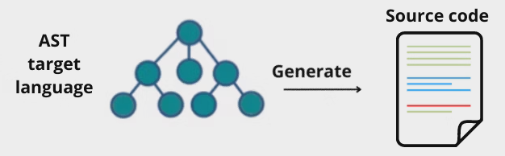

<!-- _class: topic -->
# Babel
#### Khai-Yiu Soh

---
### Overview

+ Introduction to babel
+ Timeline
+ Creating custom plugins
---
### What is Babel?

+ Babel is a toolchain mainly for converting ECMAScript 2015+ code into backwards compatible JavaScript
+ Support for old browsers or environments
+ Features:
  
  + Transform syntax
  + Polyfill
  + Source code transformations

---
### Why use Babel?

+ ECMA has released yearly updates to JavaScript
+ Babel transpiler ensures new features of JS can be used regardless of browser support

<!-- Since ES6, which was released in 2015, there's been a new update to JavaScript every year. This means browsers will frequently need to integrate changes to support new features which isn't guaranteed. However, Babel will always integrate these new standards. So using a Babel transpiler ensures developers can use new features of JavaScript without having to worry about the platform their customers use. -->

---
### How does it work? (pt. 1)

1. Babel parses the source code into an AST
  
  + @babel/parser


<!-- Babel starts with using the module @babel/parser to parse your source code into an AST which is just a structured representation of the code reflecting its syntax and structure. So under the hood it's performing lexical analysis (converting code to tokens) and then syntactic analysis (convertting tokens into AST) -->
---
### How does it work? (pt. 2)

2. Generate a new AST by applying a set of transformations to the original AST

  + @babel/traverse


<!-- It applies our specified plugins sequentially to the AST, the module @babel/traverse is used to traverse the AST, then visit and potentially transform different nodes depending on the logic. You can see it's modifying the AST in-place so there's less overhead. -->
---
### How does it work? (pt. 3)

3. Convert the new AST into transpiled source code 

  + @babel/generator



<!-- After applying all transformations, Babel generates the transpiled code from the modified AST. -->
---
<style scoped>
  code {
    font-size: 25px;
  }
</style>
### Setting up Babel

+ Installation: `npm install --save-dev @babel/core @babel/cli @babel/preset-env`
+ `@babel/core` use local configuration files
+ `@babel/cli` use Babel from the command line
+ `@babel/preset-env` preset ensuring new JS features are backwards-compatible

---
### Package.json

+ In `package.json`

```JSON
{
  "scripts": {
    "build": "babel src -d dist"
  },
  "devDependencies": {
      "@babel/cli": "^7.24.8",
      "@babel/core": "^7.25.2",
      "@babel/preset-env": "^7.25.2"
  }
}
```

<!-- In package.json, we can define a script named build which transpiles the files in the src directory and outputs it to the dist directory -->

---
### Configuration files

+ Create a `babel.config.json` file for an entire project
+ Can also use `.babelrc.json` on a subset of directories / files
  
<!-- You can specify your Babel configurations in the babel.config.json file located at the root directory. If you want to apply transformations to a subset of directories or files, use a .babelrc.json file  -->
---
### Babel plugins

+ Plugins are modules which apply code transformations
+ Order matters, apply from left to right

```JSON
{
  "plugins": ["transform-decorators-legacy","transform-class-properties"]
}
```
```JSON
{
  "plugins": ["pluginA", ["pluginB"], ["pluginC", {}]]
}
```

---
### Babel presets

+ Presets are a set of plugins or configuration options
+ Apply from right to left, plugins run before presets

```JSON
{
  "presets": ["src/my-preset", "@babel/preset-env"]
}
```
```JSON
{
  "presets": ["presetA", ["presetB"], ["presetC", {}]]
}
```

<!-- Presets are just a set of plugins or configurations tailored for a specific work environment, it saves you the hassle of configuring multiple specific plugins. And unlike plugins, they're applied right to left instead. If both presets and plugins are specified, the plugins are applied first. In the babel configuration file, you can provide the name of the preset and Babel will check node_modules to see if it's installed. You can also provide the path to a custom preset if you've created one. -->

---
### Custom presets

+ Export a configuration object
```JSON
module.exports = () => ({
  "presets": ["presetA"],
  "plugins": ["pluginA"],
  ...
})
```

<!-- Pretty simple to create a custom preset, this is just a basic template. You need to export a configuration object specifying the plugins to use, and you can even add other presets and options if you want -->
---
### Other configuration options

+ **ignore**: Files / directories to be excluded
+ **include**: Files / directories to be included
+ **comments**: Include comments in output (**true**, **false**)
+ **compact**: Omit newlines and whitespace (**auto**, **false**, **true**)
+ **minified**: Includes **compact**, shortens some statements / expressions

<!-- "ignore" specifies files / directories to not be transpiled, the option "include" does the opposite. "comments" is a boolean option with the default being true, it just determines whether the output contains any comments. "compact" removes newlines and whitespace to reduce the size of the output. If you set the value to auto, it applies compacting if there is more than 500,000 characters of code. "env" allows you to define configurations for different environments, so that's just your "test", "dev", "prod" and stuff like that. Babel will apply the basic configuration first then override any settings specified in the environment configuration. "minified" applies the "compact" option and removes block-end semicolons, parenthesis from creating a new object if given no parameters and may shorten some literals. -->

---
<style scoped>
  code {
    font-size: 25px;
  }
</style>
### Environment configurations

+ **env**: Define other configurations for specific environments

  +  `NODE_ENV=prod babel src -d dist`

```JSON
{
  "presets": ["@babel/preset-env"],
  "env": {
    "prod": {
      "comments": false
    }
  }
}
```

 <!-- There's another option, "env" which allows you to define configurations for different environments, so you can apply different settings for your "test", "dev", "prod" environments for example. Babel will apply the basic configuration first then override any settings specified in the environment configuration. --> 

---
### Polyfills

---
### Optimisation