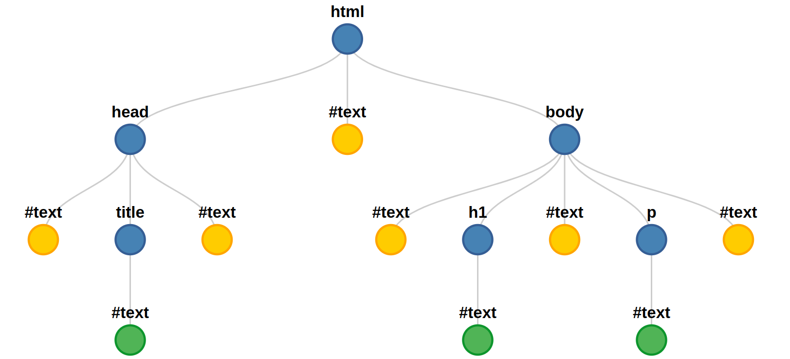

<!-- _class: lead -->
# Document Object Model
#### Khai-Yiu Soh

---
#### Introduction to the DOM

+ Developed by World Wide Web Consortium (W3C)
+ Provides comprehensive model for manipulating HTML and XML documents
+ Created interactive and dynamic web experiences

---
#### What is the DOM?

+ API for interacting with web documents

---
#### DOM representation

+ DOM creates a tree-like structural representation of a web document
+ Each object represents a node

---
#### Main Types of Nodes

+ Document
  + Root node, the document object itself is a document node
+ Element
  + HTML objects represented by tags
+ Text
  + 
+ Attribute
  + 
+ Comment
  + Comments in the HTML document
  
---
#### Tree structure

<div class="container">
<div class="code-block">

```HTML
<!DOCTYPE html>
<html lang="en">
    <head>
        <title>DOM</title>
    </head>
    <body>
        <h1>Header</h1>
        <p>Paragraph</p>
    </body>
</html>
```
</div>



</div>

---
#### Unexpected Text Nodes

+ Whitespace/newline characters are also treated as text nodes

```HTML
<!DOCTYPE html>
<html lang="en">                   
    <head>                      <!-- "\n        " -->
        <title>DOM</title>      <!-- "DOM"   &&   "\n    " -->
    </head>                     <!-- "\n    " -->
    <body>                      <!-- "\n        " -->
        <h1>Header</h1>         <!-- "Header"   &&   "\n        " --> 
        <p>Paragraph</p>        <!-- "Paragraph"   &&   "\n    \n" --> 
    </body>                     
</html>
```

---
#### Node Terminology

+ Root
  + \<html\> is the root node in a HTML document
+ Child
  + A node embedded inside another node
+ Descendant
  + A node positioned below another node within a hierarchical structure

---
#### Node Terminology

+ Parent
  + A node which contains other nodes within it
+ Sibling
  + Nodes on the same level within a hierarchical structure
+ Leaf
  + Nodes with no children

---
#### Nodes visualised in the DOM tree

---
#### Document Object

---
#### Accessing the DOM

---
#### DOM manipulation

---
#### Traversing the DOM

---
#### DOM Events

---
#### Optimisation

---
#### Browser Compatibility

---
#### References