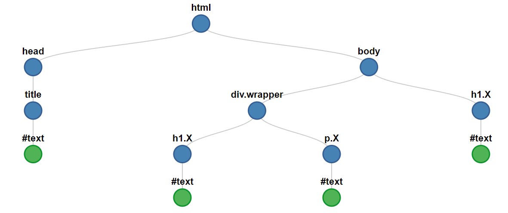

<!-- _class: lead -->
# Document Object Model
#### Khai-Yiu Soh

---
#### Introduction to the DOM

+ Developed by World Wide Web Consortium (W3C)
+ Provides comprehensive model for manipulating HTML and XML documents
+ Created interactive and dynamic web experiences

---
#### What is the DOM?

+ The DOM represents web documents as a structure of objects
+ Provides a programming interface for interacting with web pages
+ DOM enables scripts to dynamically update the document

---
#### DOM representation

+ The DOM structure is represented as a tree of objects
+ Each object is a node, corresponding to a part of the web document

---
#### Node Terminology Pt. 1

+ **Root**
  + Top-most node in a tree-like structure
+ **Descendant**
  + Any nodes below another node in the hierarchy
+ **Child**
  + A direct descendant of another node


---
#### Node Terminology Pt. 2

+ **Parent**
  + A direct ancestor of another node
+ **Sibling**
  + Nodes that share the same parent node
+ **Leaf**
  + Nodes with no children

---
#### Main Types of Nodes Pt. 1

+ **DocumentType**
  + Represents document type declaration of a web document
+ **Document**
  + Root node containing other types of nodes
  + The `document` object represents the root of the DOM tree
+ **Element**
  + HTML objects represented by tags
  + May contain attributes or child nodes

---
#### Main Types of Nodes Pt. 2

+ **Text**
  + Represents text content within an element
  + Also encompass whitespace and newline characters within document
+ **Attribute**
  + Represents attribute of an element
+ **Comment**
  + Represents comment content within \<!-- -->

---
#### Tree structure

<div class="container">
<div class="code-block">

```HTML
<!DOCTYPE html>
<html lang="en">                   
    <head>            
        <title>DOM</title>     
    </head>                  
    <body>          
        <h1>Header</h1>
        <p>Paragraph</p>
    </body>                     
</html>
```
</div>


</div>

---
#### Unexpected Text Nodes

+ Whitespace/newline characters within the document are also treated as text nodes

```HTML
<!DOCTYPE html>
<html lang="en">                   
    <head>                      <!-- "\n        " -->
        <title>DOM</title>      <!-- "DOM"   &&   "\n    " -->
    </head>                     <!-- "\n    " -->
    <body>                      <!-- "\n        " -->
        <h1>Header</h1>         <!-- "Header"   &&   "\n        " --> 
        <p>Paragraph</p>        <!-- "Paragraph"   &&   "\n    \n" --> 
    </body>                     
</html>
```

---
<style scoped> 
  .code-block {
    margin-left: 200px;
    width: 700px;
  }
</style>
#### ASCII Tree

<div class="code-block">

```HTML
Document
  └── DOCTYPE: html
  └── HTML lang="en"
        └── HEAD
        │     └── #text: "\n        "
        │     └── TITLE
        │     │     └── #text: "DOM"
        │     └──#text: "\n    "
        └── #text: "\n    "
        └── BODY
              └── #text: "\n        "
              └── H1
              │   └── #text: "Header"
              └── #text: "\n        "
              └── P
              │   └── #text: "Paragraph"
              └── #text: "\n    \n"
```
</div>

---
#### Document Object

* The `document` object represents the HTML document
* Root node in the DOM
* Property on the `window` object
* Can be accessed with `window.document` or just `document`
* Provides properties and methods to manipulate the document

---
<!-- _class: lead -->
# Accessing the DOM

---
#### Common methods

<div class="container">

+ Retrieve element by `id` attribute
  + `document.getElementById("Y")`
+ Retrieve elements by `class` name
  + `document.getElementsByClassName("X")`
+ Retrieve elements by `tag` name
  + `document.getElementsByTagName("p")`


<div class="code-block">

```HTML
<!DOCTYPE html>
<html lang="en">                   
    <head>            
        <title>DOM</title>     
    </head>                  
    <body>       
        <div class="wrapper">  
          <h1 class="X">Inner Header</h1>
          <p class="X" id="Y">Paragraph</p> 
        </div>
        <h1 class="X">Outer Header</h1>
    </body>                     
</html>
```
</div>
</div>

---
<style scoped>
  li {
    font-size: 21px;
  }
</style>
#### CSS selector methods

<div class="container">

+ Selectors are descriptors
+ Retrieve first element matching selector
  + `document.querySelector(".X")`
  + `document.querySelector("div.wrapper .X")`
+ Retrieve all elements matching selector
  + `document.querySelectorAll(".X")`
  + `document.querySelectorAll("div.wrapper .X")`


<div class="code-block">

```HTML
<!DOCTYPE html>
<html lang="en">                   
    <head>            
        <title>DOM</title>     
    </head>                  
    <body>          
        <div class="wrapper">  
          <h1 class="X">Inner Header</h1>
          <p class="X" id="Y">Paragraph</p> 
        </div>
        <h1 class="X">Outer Header</h1>
    </body>                     
</html>
```
</div>
</div>

---
#### Searching

+ Searching elements involves depth-first search with pre-order traversal
+ Visit current node, search left-most nodes then right-most nodes



---
#### Access on Element Nodes

+ Not limited to using the `document` object
+ Access methods can be applied directly to element nodes
  + `const elements = document.getElementsByTagName("div")`
  + `const divElement = elements[0]`
  + `divElement.getElementsByClassName("X")`

+ Reduced scope and traversal improves search efficiency

---
<!-- _class: lead -->
# Updating the DOM

---
<style scoped>
  li {
    font-size: 21px;
  }
</style>
#### Common methods

<div class="container">

+ Modify the HTML content within an element
  + `const divElement = document.querySelector(".wrapper")`
  + `divElement.innerHTML = "<h1>New Header</h1>"`
+ Change styles with `style` attribute
  + `const pElement = document.getElementById("Y")`
  + `pElement.style.backgroundColor = 'red'`

<div class="code-block">

```HTML
<!DOCTYPE html>
<html lang="en">                   
    <head>            
        <title>DOM</title>     
    </head>                  
    <body>          
        <div class="wrapper">  
          <h1 class="X">Inner Header</h1>
          <p class="X" id="Y">Paragraph</p> 
        </div>
        <h1 class="X">Outer Header</h1>
    </body>                     
</html>
```
</div>
</div>

---
#### Create elements

+ Create new element node using tag name
  + `const newElement = document.createElement("h1")`
+ Set the HTML within the new element
  + `newElement.innerHTML = "New Header"`

---
<style scoped>
  li {
    font-size: 21px;
  }
</style>
#### Adding elements

<div class="container">

+ Append new element node as the last child of a parent node
  + `const divElement = document.querySelector(".wrapper")`
  + `divElement.append(newElement)`

<div class="code-block">

```HTML
<!DOCTYPE html>
<html lang="en">                   
    <head>            
        <title>DOM</title>     
    </head>                  
    <body>          
        <div class="wrapper">  
          <h1 class="X">Inner Header</h1>
          <p class="X" id="Y">Paragraph</p> 
        </div>
        <h1 class="X">Outer Header</h1>
    </body>                     
</html>
```
</div>
</div>

---
<!-- _class: lead -->
# Traversing the DOM

---
<!-- _class: lead -->
# DOM Events

---
#### Optimisation

---
#### Browser Compatibility

---
#### References