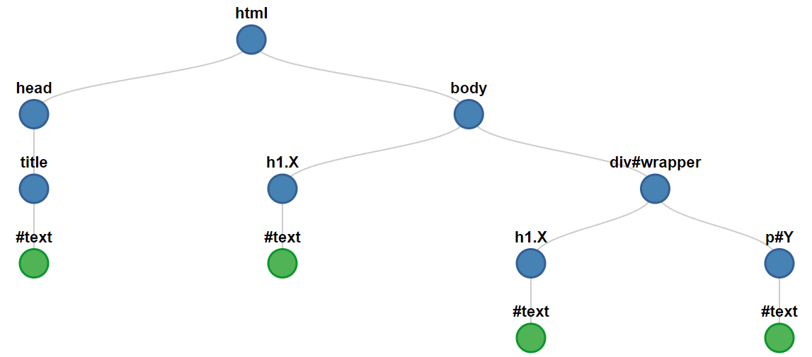

<!-- _class: lead -->
# Document Object Model
#### Khai-Yiu Soh

---
#### Introduction to the DOM

+ An application programming interface for web documents such as HTML and XML
+ Defines logical structure of documents and the way it's accessed and manipulated
+ Published by World Wide Web Consortium (W3C) in 1998
+ Create interactive and dynamic web experiences
+ Enables scripts to dynamically update DOM

---
<style scoped>
  .container {
    position: absolute;
    left: 440px;
    bottom: 60px;
  }
</style>
#### DOM representation

+ The DOM structure is represented as a tree of objects
+ Each object is a node, corresponding to a part of the web document

<div class="container">


</div>

---
#### Node Terminology Pt. 1

<div class="container">

+ **Root**
  + Top-most node in a tree-like structure
+ **Descendant**
  + Any nodes below another node in the hierarchy
+ **Child**
  + A direct descendant of another node


</div>

---
#### Node Terminology Pt. 2

<div class="container">

+ **Parent**
  + A direct ancestor of another node
+ **Sibling**
  + Nodes that share the same parent node
+ **Leaf**
  + Nodes with no children


</div>

---
#### Main Types of Nodes Pt. 1

+ **DocumentType**
  + Represents document type declaration of a web document
+ **Document**
  + Root node containing other types of nodes
  + The `document` object represents the root of the DOM tree
+ **Element**
  + HTML objects represented by tags

---
#### Main Types of Nodes Pt. 2

+ **Text**
  + Represents text content within an element
  + Also encompass whitespace and newline characters within document
+ **Attribute**
  + Represents attribute of an element
+ **Comment**
  + Represents comment content within \<!-- -->

---
#### Tree structure

<div class="container">
<div class="code-block">

```HTML
<!DOCTYPE html>
<html lang="en">                   
    <head>            
        <title>DOM</title>     
    </head>                  
    <body>          
        <h1>Header</h1>
        <p>Paragraph</p>
    </body>                     
</html>
```
</div>


</div>

---
<style scoped>
  .code-block {
    width: 1000px;
    margin-left: 50px;
    margin-top: -50px;

  }
</style>
#### Unexpected Text Nodes

+ Whitespace / newline characters within the document are also treated as text nodes

<div class="code-block">

```HTML
<!DOCTYPE html>
<html lang="en">                   
    <head>                      <!-- "\n        " -->
        <title>DOM</title>      <!-- "DOM"   &&   "\n    " -->
    </head>                     <!-- "\n    " -->
    <body>                      <!-- "\n        " -->
        <h1>Header</h1>         <!-- "Header"   &&   "\n        " --> 
        <p>Paragraph</p>        <!-- "Paragraph"   &&   "\n    \n" --> 
    </body>                     
</html>
```
</div>

---
<style scoped> 
  .code-block {
    margin-left: 200px;
    width: 700px;
  }
</style>
#### ASCII Tree

<div class="code-block">

```HTML
Document
  └── DOCTYPE: html
  └── HTML lang="en"
        └── HEAD
        │     └── #text: "\n        "
        │     └── TITLE
        │     │     └── #text: "DOM"
        │     └──#text: "\n    "
        └── #text: "\n    "
        └── BODY
              └── #text: "\n        "
              └── H1
              │   └── #text: "Header"
              └── #text: "\n        "
              └── P
              │   └── #text: "Paragraph"
              └── #text: "\n    \n"
```
</div>

---
#### Document Object

* The `document` object represents the HTML document
* Root node in the DOM
* Property on the `window` object
* Can be accessed with `window.document` or just `document`
* Provides properties and methods to manipulate the document

---
<!-- _class: lead -->
# Accessing the DOM

---
<style scoped>
  .code-block {
    position: absolute;
    bottom: 180px;
    right: 300px;
    width: fit-content;
  }
</style>
#### Access DOM

+ Retrieving specific elements/nodes within the DOM tree
+ Involves selecting elements by ID, class, tag name or defining CSS selectors
+ CSS selectors are descriptors identifying specific elements to target
  + Elements: `div`
  + Class: `.class`
  + ID: `#id`
  + Attribute: `[attribute=value]`

<div class="code-block">

```CSS
/* CSS Rule Example */

.wrapper h1 {
  font-size: 2rem;
}
```
</div>

---
<style scoped>
  li {
    font-size: 21px;
  }
</style>
#### Methods

<div class="container">

+ Retrieve element by `id` attribute
  + `document.getElementById("Y")`
+ Retrieve elements by `class` name
  + `document.getElementsByClassName("X")`
  + Returns **HTMLCollection**
+ Retrieve elements by `tag` name
  + `document.getElementsByTagName("p")`
  + Returns **HTMLCollection**


<div class="code-block">

```HTML
<!DOCTYPE html>
<html lang="en">                   
    <head>            
        <title>DOM</title>     
    </head>                  
    <body>  
        <h1 class="X">Outer Header</h1>     
        <div id="wrapper">  
          <h1 class="X">Inner Header</h1>
          <p class="X" id="Y">Paragraph</p> 
        </div>
    </body>                     
</html>
```
</div>
</div>

---
<style scoped>
  li {
    font-size: 21px;
  }
</style>
#### CSS selector methods

<div class="container">

+ Retrieve first element matching selector
  + `document.querySelector(".X")`
  + `document.querySelector("#wrapper .X")`
+ Retrieve all nodes matching selector
  + `document.querySelectorAll(".X")`
  + `document.querySelectorAll("#wrapper .X")`
  + Returns **NodeList**

<div class="code-block">

```HTML
<!DOCTYPE html>
<html lang="en">                   
    <head>            
        <title>DOM</title>     
    </head>                  
    <body>          
        <h1 class="X">Outer Header</h1>
        <div id="wrapper">  
          <h1 class="X">Inner Header</h1>
          <p class="X" id="Y">Paragraph</p> 
        </div>
    </body>                     
</html>
```
</div>
</div>

---
#### Differences

+ `querySelector` / `querySelectorAll` are newer and function as all-in-one methods
  + `querySelectorAll` returns a static NodeList
  + Contents of NodeList don't change even if DOM updates
+ `getElementsByClassName` / `getElementsByTagName` return a HTMLCollection
  + A live collection, automatically updates if document changes
  + Best to make a copy using `Array.from`, destructuring, etc.

---
<style scoped>
  li {
    font-size: 20px;
  }

  li:last-child {
    margin-bottom: -40px;
  }
</style>
#### Searching

+ Queries searching with ID are constant look-up
+ CSS selector methods use depth-first search with pre-order traversal
+ Visit current node, search left-most nodes then right-most nodes



---
#### Access on Element Nodes

+ Not limited to using the `document` object
+ Access methods can be applied directly to element nodes except `getElementById`
  + `const divElement = document.getElementById("wrapper")`
  + `divElement.getElementsByClassName("X")`

+ Reduced scope and traversal improves search efficiency

---
<!-- _class: lead -->
# Traversing the DOM

---
#### Traverse DOM

+ Access elements relative to other elements
+ Navigate through specific structure efficiently with minimal queries
+ Moving up, down or sideways within the DOM hierarchy 
+ Finding parent, child or sibling elements

---
<style scoped>
  .code-block {
    width: 1000px;
    margin-left: 50px;
    margin-top: -50px;
  }
</style>
#### Properties

+ `childNodes` : list of child nodes
+ `firstChild` / `lastChild` : node's first child or last child
+ `parentElement` / `parentNode` : node's parent **element** or any node type
+ `nextSibling` : following adjacent node specified by parent's `childNodes`
+ `previousSibling` : preceding adjacent node specified by parent's `childNodes`

<div class="code-block">

```JavaScript
const children = parent.childNodes      // [h1, p, h2, div, h3]
const firstChild = parent.firstChild    // h1
children[2].nextSibling                 // div
children[2].previousSibling             // p
firstChild.parentElement                // <div id="wrapper"> ... </div>
```
</div>

---
<style scoped>
  .code-block {
    width: 1000px;
    margin-left: 50px;
    font-size: 25px;
  }
</style>
#### Print out DOM tree

<div class="code-block">

```JavaScript
function printTree(node, spacing) {
    if (node.nodeType === Node.TEXT_NODE) {
        const text = node.textContent.trim();
        if (text !== "") {
            console.log(`${spacing}${text}`);
        }
    } else {
        console.log(`${spacing}<${node.nodeName.toLowerCase()}>`);
        if (node.firstChild) {
            printTree(node.firstChild, spacing + "    ");
        }

        console.log(`${spacing}</${node.nodeName.toLowerCase()}>`);
    }

    if (node.nextSibling) {
        printTree(node.nextSibling, spacing);
    }
}
```
</div>

---
<!-- _class: lead -->
# Updating the DOM

---
#### Creating elements

<div class="container">

+ Create new element node using tag name
  + `const h1Element = document.createElement("h1")`
+ Modify text within an element
  + `h1Element.textContent = "New Header"`
+ Change styles with `style` attribute
  + `h1Element.style.backgroundColor = "red"`
  + `h1Element.style.fontSize = "100px"`

---
<style scoped>
  li {
    font-size: 19px;
  }

  .container {
    position: absolute;
    right: 160px;
    top: 160px;
  }
</style>
#### Adding / Removing elements

+ `const parentElement = document.getElementById("wrapper")`
+ Append element as the last child of a node
  + `parentElement.append(h1Element)`
+ Prepend element as the first child of a node
  + `parentElement.prepend(h1Element)`
+ Insert before a child node of a specified parent node
  + `const children = parentElement.childNodes`
  + `parentElement.insertBefore(h1Element, children[i])`
+ Removing element from the DOM
  + `h1Element.remove()`

<div class="container">


</div>

---
<!-- _class: lead -->
# DOM Events

---
#### Adding events

+ Add multiple event listeners for a single event
  + `btnElement.addEventListener("mousedown", functionA)`
  + `btnElement.addEventListener("mousedown", functionB)`
+ Sometimes, elements have event properties prefixed with `on`
  + `btnElement.onmousedown = functionA`
  + `btnElement.onmousedown = functionB` overwrites subsequent value
+ Inline event handlers mix HTML and JS, becomes less maintainable
  + `<button onmousedown="functionA()">Click me!</button>`

---
<style scoped>
  .code-block {
    width: 1000px;
    margin-left: 50px;
    margin-top: -50px;
  }
</style>
#### Event objects

+ Automatically passed to event handlers to provide extra features
+ `event.target` references the element the event occurred upon
  + Access to element's node properties
+ Event objects have a standard set of properties and methods
  + Some event objects add extra relevant properties

<div class="code-block">

```JavaScript
btnElement.addEventListener("mousedown", (event) => {
  event.target.style.backgroundColor = "red"
  console.log(event)    // MouseEvent
})
```
</div>

---
### Propagation process

+ **Capturing phase:** Event travels from the root towards target element
  + Ancestors can capture the event first and invoke listeners
  + Event capture disabled by default: `element.addEventListener(event, handler, true)`
+ **Target phase:** When event reaches target, invoke any attached listeners
+ **Bubbling phase:** Event bubbles up DOM tree, triggering listeners on ancestors
  + Similar to capturing phase, but reversed
  + Default behaviour, can omit `capture` argument in `addEventListener`

---
<style scoped>
  li:first-child {
    margin-top: -150px;
  }

  .code-block {
    width: 1000px;
    margin-left: 50px;
  }
</style>
#### Event delegation

<div class="code-block">

```HTML
<html> ─┐
    ... │     
    <body> ─┐ 
        <div> ────┐ 
            <button>Click me!</button>
        </div>
    </body>
</html>
```
</div>

+ Event is fired from the **\<button>** and invokes any listeners on it
+ Event is propagated up the DOM tree from the **\<button>** to the root node

---
<style scoped>
  .code-block {
    width: 1000px;
    margin-left: 50px;
    margin-top: -50px;
  }
</style>
#### Example

+ `event.currentTarget` references the element which the event handler has been attached
+ `event.stopPropagation()` prevents event bubbling to ancestor elements

<div class="code-block">

```JavaScript
function handleClick(event) {
  console.log(`Clicked on ${event.currentTarget}`)
}

const capture = false;
const divElement = document.querySelector("div")
const btnElement = document.querySelector("button")

document.addEventListener("mousedown", handleClick, capture)                   // Document
document.documentElement.addEventListener("mousedown", handleClick, capture)   // <html>
document.body.addEventListener("mousedown", handleClick, capture)              // <body>
divElement.addEventListener("mousedown", handleClick, capture)                 // <div>
btnElement.addEventListener("mousedown", handleClick, capture)                 // <button>
```
</div>

---
<!-- _class: lead -->
# Best Practices

---
<style scoped>
  li:last-child {
    margin-bottom: -55px;
  }

  .code-block {
    width: 1000px;
    margin-left: 45px;
    margin-top: -10px;
  }
</style>
#### Cache elements

+ Frequently accessed elements should be stored in a variable
+ With no caching:

<div class="code-block">

```JavaScript
for(let i = 0; i < document.getElementsByTagName("p").length; i++) {
  document.getElementsByTagName("p")[i].style.color = "red";
}
```
</div>

+ With caching:

<div class="code-block">

```JavaScript
const paragraphs = document.getElementsByTagName("p")

for(let i =  0; i < paragraphs.length; i++) {
  paragraphs[i].style.color = "red";
}
```
</div>

---
#### InnerHTML property

+ Read and set HTML content within an element
  + `document.body.innerHTML = "<h1>New Header</h1>"`
+ Security risk: Potentially insert malicious content
  + Cross-site scripting: Executing code through HTML injection
+ HTML specifies **\<script>** tags are treated as plain text
+ There are other ways to execute without using **\<script>**
  + `document.body.innerHTML = ""`
+ Use `setHTML()` instead, sanitises HTML string first

---
<style scoped>
  li:last-child {
    margin-bottom: -50px;
  }

  .code-block {
    width: 1000px;
    margin-left:50px;
  }
</style>
#### Batch DOM updates

+ Create a document fragment with `.createDocumentFragment`
+ Group multiple updates before performing a single document insertion

<div class="code-block">

```JavaScript
const parent = document.getElementById("wrapper")
const fragment = document.createDocumentFragment()

for(let i = 0; i < 100; i++) {
  const newButton = document.createElement("button")
  newButton.textContent = `Button ${i}`
  fragment.append(newButton)
}

parent.append(fragment)
```
</div>

---
<style scoped>
  li:last-child {
    font-size: 22px;
    margin-top: -20px;
  }

  .code-block {
    width: 1000px;
    margin-left: 50px;
    margin-top: -50px;
  }
</style>
#### Events on dynamic lists

+ Multiple listeners can lead to suboptimal performance and memory usage

<div class="code-block">

```JavaScript
const buttonList = document.getElementsByTagName("button")

for(const button of buttonList) {
  button.addEventListener("click", (event) => alert(event.target.textContent))
}
```
</div>

+ Instead, attach one event listener to a common ancestor element

<div class="code-block">

```JavaScript
const parent = document.getElementById("wrapper")

parent.addEventListener("click", (event) => {
  if (event.target.tagName === "BUTTON") {
    alert(event.target.textContent)
  }
})  
```
</div>

---
<!-- _class: lead -->
# Thanks for listening!