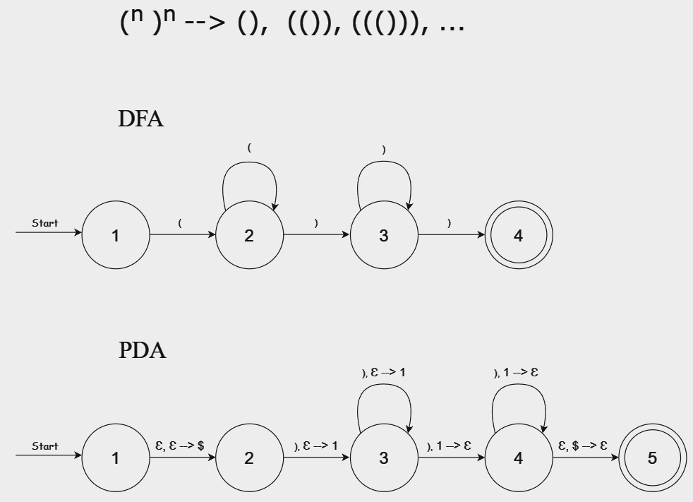
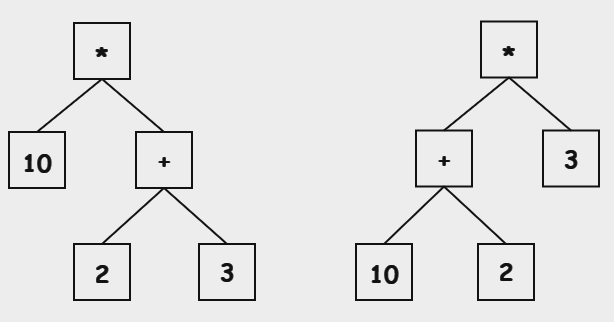

<!-- _class: topic -->
# Interpreters - Context Free Grammar
#### Khai-Yiu Soh

---
### Overview

+ Introduction to Context Free Grammar
+ Defining CFG rules for Lua

---
### What is Context Free Grammar?

+ A formal grammar for defining the syntax of a language
+ Consists of a set of rules describing all possible strings
+ Need to establish the syntax rules before implementation
+ Create recursive descent parser

  + Simple to implement
  + Directly map rules to parsing functions

---
### Components of CFG

+ **Production rules:** Rules combining terminals and non-terminals
+ **Terminals:** The basic "alphabet" which forms strings

  + Letters form words, words form sentences
  + Tokens form the grammar of the programming language
+ **Non-terminals:** A named reference to another rule to compose grammar

  + S --> 'a'A ;
  + A --> 'b' | 'c' ;
+ **Start symbol:** Represents the language, root of the production process
+ Other symbols: **|**, **?**, _*_
---
### Example

```Bash
identifier --> (letter | "_") (letter | digit | "_")*
letter     --> 'a' | 'b' | 'c' | 'd' | 'e' | 'f' | 'g' | 'h' | 'i' | 'j' | 'k' | 'l' | 'm' | 
               'n' | 'o' | 'p' | 'q' | 'r' | 's' | 't' | 'u' | 'v' | 'w' | 'x' | 'y' | 'z' | 
               'A' | 'B' | 'C' | 'D' | 'E' | 'F' | 'G' | 'H' | 'I' | 'J' | 'K' | 'L' | 'M' | 
               'N' | 'O' | 'P' | 'Q' | 'R' | 'S' | 'T' | 'U' | 'V' | 'W' | 'X' | 'Y' | 'Z'
digit      --> '0' | '1' | '2' | '3' | '4' | '5' | '6' | '7' | '8' | '9'
```

+ A programming language's grammar is composed of statements and expressions
```Bash
program    --> (statement)* ;
statement  --> ?? ;
expression --> ?? ;
```
---
### Regular vs Context Free

+ A regular language can be described by regular expressions
+ Regular expressions are sequences of characters defining a pattern
+ Don't use extra memory apart from knowing its current state
+ Context-free languages can be described with CFG
+ May use additional memory (stack to track recursive structures)

---
### Balanced Parentheses Example



---
### Usage in interpreters

+ Tokenisation involves matching the substrings with a specific pattern
+ The lexical structure is regular, it can be defined with regular expressions
+ Parsing analyses the structure of the program

  + Conditional statements
  + Loops
  + Function calls
+ CFGs being more expressive, can describe nested structures of arbitrary depth
---
### Expressions and statements

+ An expression is evaluated to produce a value
  
  + Values (ex. `10`)
  + Operators (ex. `4 + 8 / 2`)
  + Function calls (ex. `max(a, b)`)

+ A statement is an instruction that can be executed to perform an action

  + Assignments
  + Control flow (conditions, loops)
  + Function and class definitions
  + Expression statements (ex. `print(x)`)
---
### Statements

+ Define a set of grammar rules for:
  
  + Variable assignments / declarations
  + Blocks
  + Control structures
  + Function calls

---
### Variables

+ There are global, local variables and table fields
+ An identifier represents a variable (`myTable`, `x`, `_variable`)
+ Square brackets are used to index a table (`myTable["key"]`, `myTable[2]`)
+ Can also use "." syntax (`myTable.key`)
+ Can index the result of a variable, result of function call or another table

```Bash
variable         --> identifier | 
                     prefixExpression '[' expression ']' | 
                     prefixExpression '.' identifier ;

prefixExpression --> variable | functionCall | '(' expression ')'
```
---
### prefixExpression examples

```Lua
table = { x = 30 }
print(table['x'])   -- `prefixExpression` = `table`
```
```Lua
function getTable()
    return { x = 30 }
end

print(getTable()['x'])  -- `prefixExpression` = `getTable()`
```
```Lua
table = { x = { y = 30 }}
print(table['x']['y'])  -- `prefixExpression` = `table['x']`
```
---
### Variable assignments

+ Multiple assignments allowed

+ Left side: List of variables
+ Right side: List of expressions
+ Delimiter: **,**

```Lua
a = 3
x = {}
b, c, x[a] = a - 1, "Hello", 20
```
---
### Variables grammar

```bash
statement      --> variableList '=' expressionList ;
variableList   --> variable (',' variable)* ;
expressionList --> expression (',' expression)* ;
variable       --> identifier | 
                   prefixExpression '[' expression ']' | 
                   prefixExpression '.' identifier ;
```
---
### Local declarations

+ Use **local** keyword
+ Can specify attributes with **< >** (`local x<const> = 10` )

```Bash
statement   --> variableList '=' expressionList |

                'local' attrVarList ('=' expressionList)? ;

attrVarList --> identifier attribute (',' identifier attribute)* ;
attribute   --> ('<' identifier '>')? ;
```
---
### Blocks

+ Blocks are a list of statements executed sequentially

  + A program can have 0 or many statements
  + Blocks sometimes have a return statement

```bash
block --> (statement)* returnStatement? ;
```

---
### Chunks

+ In Lua, a "chunk" represents a sequence of statements followed optionally by a return statement
+ Represents a complete or part of a Lua script
+ Syntactically, a chunk is just a block

  + Source files are treated as a chunk
  + Using **load** function to execute a string of Lua code
  + Blocks of anonymous functions

```bash
chunk --> block ;
```
---
### Control structures

+ **if**, **then** and **end** are required
+ 0 or more **elseif**
+ Optional **else**
+ Blocks containing statements to execute
```Lua
if x > 0 then
    print("Number is positive")
elseif x == 0 then
    print("Number is zero")
else
    print("Number is negative")
end
```
---
### Updated statement rule

```bash
statement --> variableList '=' expressionList |

              'local' attrVarList ('=' expressionList)? |

              'if' expression 'then' block 
              ('elseif' expression 'then' block)*
              ('else' block)? 
              'end' ;

```
---
### While loop

* **while**, **do** and **end** keywords
+ Block containing statements to execute

```Lua
count = 10

while count > 0 do
    print(count)
    count = count - 1
end
```
---
### Updated statement rule

```bash
statement --> ... |

              'while' expression 'do' block 'end' ;

```
---
### Repeat until loop

+ **repeat** and **until** keywords
+ Block containing statements to execute
+ Expression at the end

```Lua
count = 0

repeat
    print(count)
    count = count + 1
until count == 10
```
---
### Updated statement rule
```bash
statement --> ... |

              'repeat' block 'until' expression ;

```
---
### For loops

+ Numerical for loop

  + Block is repeated as a variable undergoes arithmetic progression
+ Generic for loop (iterators)

  + Block is repeated as long as iterator function can produce a new value
---
### Numerical for loop

+ **for**, **do** and **end** keywords
+ Block containing statements to execute
+ Can specify three values for initial, min / max value, increment

```Lua
for i = 1, 5, 2 do
    print("Iteration", i)
end
```
---
### Updated statement rule

```Bash
statement --> ... |

              'for' identifier '=' expression ',' expression
              (',' expression)?
              'do' block 'end' ;

```
---
### Generic for loop

+ **for**, **in**, **do** and **end** keywords
+ List of variable names
+ Block containing statements to execute

```Lua
local person = {
    name = "Bob",
    age = 30,
    city = "Perth"
}

for key, value in pairs(person) do
    print(key, ":", value)
end
```
---
### Updated statement rule

```Bash
statement --> ... |

              'for' identifierList 'in' expressionList 'do' block 'end' ;

identifierList  --> identifier (',' identifier)* ;
```
---
### Function calls

+ Can be executed to simply perform actions with no return value
+ 0 to many arguments
+ Can use ":" syntax to invoke functions on tables, passing its own reference

<div class="container">
<div class="code-block-normal">

```Lua
function greet(name)
    print("Hello, " .. name)
end

greet("Bob")
```
</div>
<div class="code-block-normal">

```Lua
table = {
    greet = function(self, name)
        print("Hello, " .. name)
        print("Hello, " .. self.name)
    end,
    name = "Mary"
}

table:greet("Bob")
```
</div>
</div>

---
### Updated statement rule

```Bash
statement    --> ... |

                 functionCall ;

functionCall --> prefixExpression arguments | 
                 prefixExpression ':' identifier arguments ;

arguments    --> '(' expressionList? ')' ;
```
---
### Function definitions

+ Optionally, use **local** keyword
+ **function** and **end** required
+ Name, optional list of parameters, function body
```Lua
function greet()
    print("Hello")
end
```
```Lua
local function greet()
    print("Hello")
end
```
---
### Function names

+ Identifier
+ Declare functions in table fields (global)
+ Declare functions with colon syntax (global)

<div class="container">
<div class="code-block-normal">

```Lua
table = { 
    nestedTable = {} 
}

function table.nestedTable.greet()
    print("Hello")
end

table.nestedTable.greet()
```
</div>
<div class="code-block-normal">

```Lua
table = { 
    name = "Bob" 
}

function table:greet()
    print("Hello from: ", self.name)
end

table:greet()   -- Same as table.greet(table)
```
</div>
</div>

---
### Function parameters

+ Empty
+ List of identifiers
+ Optionally, use spread syntax at the end for variadic functions
```Lua
function func(a, b, ...)
    print(...)  -- 3, 4
end

func(1, 2, 3, 4)
```
---
### Updated statement rule

```Bash
statement     --> ... |

                  'function' functionName body |
                  'local function' identifier body ;

functionName  --> identifier ('.' identifier)* (':' identifier)? ;
body          --> '(' (parameterList)? ')' block 'end' ;
parameterList --> identifierList (',' '...')? | '...' ;
```
---
### Expressions

+ Types of expressions to consider:

  + Literals (number, string, boolean)
  + Unary operations
  + Binary operations
  + Prefix expressions
  + Anonymous function
  + Table
---
### Table example

+ Separate with either , or ;
+ Implicit index assignments override explicit assignments

```Lua
mixedTable = {
    [1] = "first",
    [2] = "second";
    key1 = "value1",
    key2 = "value2";
    "default"
}

print(mixedTable[1])  -- "default"
```
---
### Expressions in Lua

```Bash
expression     --> literal | 
                  unaryOp expression |
                  expression binaryOp expression |
                  prefixExpression | table | functionDef ;
  
literal        --> NUMBER | STRING | "true" | "false" | "nil" | '...' ;
unaryOp        --> "-" | "~" | "not" | "#"
binaryOp       --> "==" | "~=" | "<" | "<=" | ">" | ">=" | "+" | "-" | "*" | "/" |
                  "^" | "%" | ".." | "|" | "//" | "%" | "&"| "<<" | ">>" | 
                  "and" | "or" ;
  
functionDef    --> 'function' body ;
  
table          --> '{' fieldList? '}' ;
fieldList      --> field (fieldSeparator field)* fieldSeparator? ;
field          --> '[' expression ']' '=' expression | identifier '=' expression | expression ;
fieldSeparator --> ',' | ';'
```
---
### Ambiguity

+ Precedence: Determine which operator is evaluated first
+ Consider the expression: `10 / 2 + 3`
+ The rules generate the same string but different trees



---
### Addressing ambiguity

+ Restructure the grammar

  + Evaluate operators with higher precedence first
  + Create a rule for each precedence level
  + Each rule matches expressions at its precedence level or higher

+ Associativity: Determine which common operators are evaluated first

  + Left-associative: `10 / 5 / 2`
  + Right-associative: `a = b = c`

---
<style scoped>
  li {
    font-size: 25px;
  }
</style>
### Precedence and associativity in Lua

+ Binary operators are left associative, except **..** and **^**
+ Listed from highest to lowest precedence

<div class="container">
<div class="code-block-normal">

  1. ^
  2. not, #, -, ~
  3. *, /, //, %
  4. +, -
  5. ..
  6. <<, >>
</div>
<div class="code-block-normal">

  7. &
  8. ~
  9. |
  10. <, >, <=, >=, ~=, ==
  11. and
  12. or
</div>
</div>

---
### New grammar for expressions

```Bash
expression    --> logicalOr ;
logicalOr     --> logicalAnd ("or" logicalAnd)* ;
logicalAnd    --> comparison ("and" comparison)* ;
comparison    --> bitwiseOr (( "==" | "~=" | ">" | ">=" | "<" | "<=" ) bitwiseOr)* ;
bitwiseOr     --> bitwiseXor ( "|" bitwiseXor )* ;
bitwiseXor    --> bitwiseAnd ( "~" bitwiseAnd )* ;
bitwiseAnd    --> shift ( "&" shift )* ;
shift         --> concatenation (( "<<" | ">>" ) concatenation)* ;
concatenation --> term ( ".." concatenation )* ;
term          --> factor (( "+" | "-" ) factor)* ;
factor        --> unary (( "*" | "/" | "//" | "%" ) unary)* ;
unary         --> ( "-" | "not" | "#" | "~" ) unary | power ;
power         --> primary ("^" power)* ;
primary       --> NUMBER | STRING | BOOLEAN | NIL | "(" expression ")" ;

```
---
### Next step

+ Implement parser, generating AST
+ Map each grammar rule directly to functions

---
### References

+ Lua documentation: https://www.lua.org/manual/5.4/manual.html#9