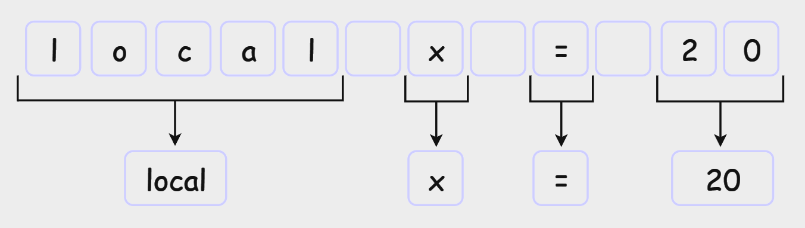

<!-- _class: topic -->
# Interpreters - Lexical Analysis
#### Khai-Yiu Soh

---
### What are interpreters?

+ For any language, source code must be translated to binary code before the computer can execute it
+ Interpreters are one of these translation processes
+ A program that executes code line by line without prior compilation

---
<style scoped>
  img {
    border-radius: 30px;
  }
</style>
### Characteristics

<div class="container">

+ No intermediate object code generated
+ Less memory required
+ Relatively slower, converts high-level to low-level language every time
+ Detect errors immediately

<div class="image-container">


</div>
</div>

---
### Interpreter Process

##### Lexical Analysis

+ Scanning the source code character by character, grouping them into tokens
+ **Token**: Represents individual elements of a programming language's syntax
+ **Lexeme**: A sequence of characters that matches a pattern for a token
+ **Lexer**: Component which scans the source code and creates tokens

--- 
### Interpreter Process Pt. 2

+ Syntax Analysis (Parsing):
  + Verifies the arrangement of tokens following a set of grammar rules
  + Constructs Abstract Syntax Tree
+ Semantic Analysis:
  + Checks for logical errors, type declarations, scoping, etc.
+ Evaluation:
  + Traverse AST and produce program output

---
### Writing lexer for Lua

+ Identify syntax: Rules for identifiers, keywords, operators, literals, etc.
  + https://hackage.haskell.org/package/language-lua-0.11.0.1/docs/Language-Lua-Token.html
+ Tokenisation strategy: Character by character, matching with regex
  + Massive switch case
+ Error handling: Invalid characters, unterminated strings or comments
+ Not concerned with grammar at this stage

---
<style scoped>
  .code-block-normal {
    font-size: 35px;
  }
</style>
### Token structure

<div class="container">

+ `type`: Token type
+ `lexeme`: Raw source code
+ `value`: Interpreted value
+ `line`: Line of occurrence

<div class="code-block-normal">

```JavaScript
function Token(type, lexeme, value, line) {
    this.type = type;
    this.lexeme = lexeme;
    this.value = value;
    this.line = line;
}
```
</div>
</div>

---
### Token Types

<div class="container">

| Token Type   | Matches |
| ------------ | --------|
| PLUS         | +       |
| MINUS        | -       |
| STAR         | *       |
| SLASH        | /       |
| PERCENT      | %       |
| LEFT_PAREN   | (       |
| RIGHT_PAREN  | )       |
| LEFT_BRACE   | {       |
| RIGHT_BRACE  | }       |
| LEFT_BRACKET | [       |
| RIGHT_BRACKET| ]       |

| Token Type  | Matches |
| ----------- | --------|
| CARET       | ^       |
| TAG         | #       |
| ASSIGN      | =       |
| LESS        | <       |
| GREATER     | >       |
| COLON       | :       |
| SEMICOLON   | ;       |
| AMPERSAND   | &       |
| PIPE        | \|      |
| TILDE       | ~       |
| PERIOD      | .       |

| Token Type   | Matches |
| ------------ | --------|
| EQUAL        | ==      |
| NOT_EQUAL    | ~=      |
| LESS_EQUAL   | <=      |
| GREATER_EQUAL| >=      |
| LEFT_SHIFT   | <<      |
| RIGHT_SHIFT  | >>      |
| DOUBLE_SLASH | //      |
| DOUBLE_COLON | ::      |
| CONCATENATE  | ..      |
| ELLIPSIS     | ...     |
</div>

---
### More Token Types (Keywords)

<div class="container">

| Token Type  | Matches     |
| ----------- | ----------- |
| IF          | if          |
| ELSE        | else        |
| ELSEIF      | elseif      |
| THEN        | then        |
| AND         | and         |
| OR          | or          |
| NOT         | not         |

| Token Type  | Matches     |
| ----------- | ----------- |
| WHILE       | while       |
| DO          | do          |
| REPEAT      | repeat      |
| UNTIL       | until       |
| FOR         | for         |
| IN          | in          |
| BREAK       | break       |
| RETURN      | return      |

| Token Type  | Matches     |
| ----------- | ----------- |
| FUNCTION    | function    |
| END         | end         |
| LOCAL       | local       |
| TRUE        | true        |
| FALSE       | false       |
| NIL         | nil         |
| GOTO        | goto        |
| CONTINUE    | continue    |
</div>

---
### Non-useful lexemes

+ Don't provide any benefit to the parser
+ Ignore comments **--**, comment blocks **--[[ --]]**
+ Ignore white space
+ Ignore newlines **\n**, tabs **\t**, carriage returns **\r**

---
### Token Example



```JavaScript
Token { type: LOCAL,          lexeme: "local", value: null, line: 1 }
Token { type: IDENTIFIER,     lexeme: "x",     value: null, line: 1 }
Token { type: ASSIGN,         lexeme: "=",     value: null, line: 1 }
Token { type: NUMBER_LITERAL, lexeme: "20",    value: 20,   line: 1 }
```
---
<style scoped>
  li {
    font-size: 22px;
  }
  .code-block-normal {
    font-size: 45px;
  }
</style>
### Lexer structure

<div class="container">

+ `tokenList`: Stores tokens
+ `sourceCode`: Lua code (String)
+ `startPosition`: Starting index of current lexeme
+ `currentPosition`: Current index of `sourceCode`
+ `currentLine`: Line where lexeme occurs

<div class="code-block-normal">

```JavaScript
function Lexer(sourceCode) {
    this.tokenList = [];
    this.sourceCode = sourceCode;
    this.startPosition = 0;
    this.currentPosition = 0;
    this.currentLine = 1;
}
```
</div>
</div>

---
### Helper methods

```JavaScript
1   function advance() {
2       currentCharacter = sourceCode[currentPosition]
3       currentPosition++;
4
5       return currentCharacter;
6   }
7
8   function isEndOfFile() {
9       return currentPosition >= sourceCode.length;
10  }
```

---
### Iterating source code

```JavaScript
1   function scanTokens() {
2       while (!isEndOfFile()) {
3           startPosition = currentPosition;
4           tokenise();
5       }
6
7       addToken(EOF);
8
9       return tokenList;
10  }
```
---
### Switch Case

```JavaScript
1   function tokenise() {
2       const currentCharacter = advance();
3
4       switch (currentCharacter) {
5           case "(":
6               addToken(LEFT_PAREN);
7               break;
8           // A lot more cases
9       }
10  }
```
---
### Adding Tokens

```JavaScript
1   function addToken(tokenType, tokenValue = null) {
2       const tokenLexeme = sourceCode.slice(startPosition, currentPosition);
3       const newToken = new Token(tokenType, tokenLexeme, tokenValue, currentLine);
4
5       tokenList.push(newToken);
6   }
```


---
<style scoped>
  .code-block-normal {
    font-size: 35px;
  }
</style>
### Single character tokens

<div class="code-block-normal">

```JavaScript
switch (currentCharacter) {
    case "(": addToken(LEFT_PAREN); break;
    case ")": addToken(RIGHT_PAREN); break;
    case "{": addToken(LEFT_BRACE); break;
    case "}": addToken(RIGHT_BRACE); break;
    case "[": addToken(LEFT_BRACKET); break;
    case "]": addToken(RIGHT_BRACKET); break;
    case ",": addToken(COMMA); break;
    case ";": addToken(SEMICOLON); break;
    case "&": addToken(AMPERSAND); break;
    case "|": addToken(PIPE); break;
    case "#": addToken(TAG); break;
    case "^": addToken(CARET); break;
    case "+": addToken(PLUS); break;
    case "*": addToken(STAR); break;
    // More cases below
}
```
</div>

---
### Errors

```JavaScript
switch (currentCharacter) {
    ...

    default:
        console.log(`Invalid character "${currentCharacter}" at line ${currentLine}`);
}
```
---
### Current output

```Lua
local x = 20
```
```JavaScript
Invalid character "l" at line 1
Invalid character "o" at line 1
Invalid character "c" at line 1
Invalid character "a" at line 1
Invalid character "l" at line 1
Invalid character "x" at line 1
Token { type: ASSIGN, lexeme: "=", value: null, line: 1 }
Invalid character "2" at line 1
Invalid character "0" at line 1
```

---
### Multi-character tokens

+ Need to check for two or more characters now
+ Method **matchNext** checks if the following fixed number of characters match
+ Ex. **Assign** (=) and **Equal** (==) operators both contain =

```Lua
-- Current implementation generates 3 Assign tokens
-- Goal: 1 Assign and 1 Equal token

local x = 20 == 10
```

---
### matchNext

+ If condition is met, basically performs **advance()**

```JavaScript
1   function matchNext(charactersToMatch) {
2       const endSlicePosition = currentPosition + charactersToMatch.length;
3       const nextCharacters = sourceCode.slice(currentPosition, endSlicePosition)
4    
5       if (isEndOfFile() || nextCharacters !== charactersToMatch) {
6           return false;
7       }
8
9       currentPosition = currentPosition + charactersToMatch.length;
10
11      return true;
12  }
```

---
### Updated switch case

+ Ternary expression to determine which token type is added

```JavaScript
1  switch (currentCharacter) {
2      ...
3
4      case "=": 
5          addToken(matchNext("=") ? EQUAL : ASSIGN); 
6          break;
7      ...
8  }
```

---
### Current output

```Lua
local x = 10 == 20
```
```JavaScript
Invalid character "l" at line 1
Invalid character "o" at line 1
Invalid character "c" at line 1
Invalid character "a" at line 1
Invalid character "l" at line 1
Invalid character "x" at line 1
Token { type: ASSIGN, lexeme: "=", value: null, line: 1 }
Invalid character "1" at line 1
Invalid character "0" at line 1
Token { type: EQUAL, lexeme: "==", value: null, line: 1 }
Invalid character "2" at line 1
Invalid character "0" at line 1
```

---
### Special lexemes

+ Variable-length sequence of characters
+ Begin and end with specific character/s
+ Comments: **-- \n**

  + Ex. -- This is a comment\n
+ Comment blocks:  **--[[ --]]**
+ Strings: **""** or **''**
+ Numbers: (loop while checking if character is digit)
  + Ex. local x = **123456789**


---
### Lookahead

+ Similar to **advance** but the **currentPosition** doesn't change

  + Ex. A stack has **peek** and **pop** methods
  + Stack's **peek**: returns the element at the top but doesn't remove it
  + **pop**: returns the element at the top and removes it
  + Lexer's **peek**: returns the next element but doesn't update the position
  + **advance**: returns the next element and updates the position

---
### Peek

+ Modified to peek an arbitrary number of characters

```JavaScript
1  function peek(charactersToLookAhead = 0) {
2      if (currentPosition + charactersToLookAhead >= sourceCode.length) {
3          return "\0";
4      }
5
6      return sourceCode[currentPosition + charactersToLookAhead];
7  }
```

---
### Comments

+ Keep advancing until the comment lexeme is consumed
+ Terminating character: \n

```JavaScript
1  function comment() {
2      while (peek() !== "\n" && !isEndOfFile()) {
3         advance();
4      }
5  }
```

---
<style scoped>
  code {
    font-size: 22px;
  }
</style>
### Comment Blocks

+ Keep advancing until comment block lexeme is consumed
+ Terminating characters: --]]

```JavaScript
1   function commentBlock() {
2       while (!matchNext('--]]')) {
3           if (peek() === '\n') {
4               currentLine++;
5           } else if (isEndOfFile()) {
6               throw new Error(
7                   `Unterminated comment block at line ${this.currentLine}`,
8               );
9           }
10
11          advance();
12      }
13  }
```

---
### Updated minus case

<div class="container">

+ Three cases to consider:
  
  + Minus -
  + Comment --
  + Comment block --[[

<div class="code-block-normal">

```JavaScript
1 if (matchNext('-[[')) {
2       commentBlock();
3  } else if (matchNext('-')) {
4      comment();
5  } else {
6      addToken(MINUS);  
7  }
```
</div>
</div>

---
<style scoped>
  code {
    font-size: 20px;
  }
</style>
### Strings

+ Terminating character: " or '

```JavaScript
1   function string(quoteType) {
2       while (peek() !== quoteType && !isEndOfFile()) {
3           if (peek() === '\n') {
4               throw new Error(`Unterminated string at line ${currentLine}`);
5           }
6
7           advance();
8       }
9
10      if (isEndOfFile()) {
11          throw new Error(`Unterminated string at line ${currentLine}`);
12      }
13
14      advance();
15      addToken(
16          STRING,
17          sourceCode.slice(startPosition + 1, currentPosition - 1),
18      );
19  }
```

---
<style scoped>
  code {
    font-size: 22px;
  }
</style>
### Digits

```JavaScript
1   function number() {
2       while (isDigit(peek())) {
3           advance();
4       }
5
6       if (peek() === '.' && isDigit(peek(1))) {
7           advance();
8
9           while (isDigit(peek())) {
10              advance();
11          }
12      }
13
14      addToken(
15          NUMBER,
16          Number(sourceCode.slice(startPosition, currentPosition)),
17      );
18  }
```

---
<style scoped>
  code {
    font-size: 22px;
  }
</style>
### Identifiers and Reserved words

```JavaScript
1   function identifier() {
2       while (isAlphaNumeric(peek())) {
3           advance();
4       }
5
6       const value = sourceCode.slice(
7           startPosition,
8           currentPosition,
9       );
10      const type = reservedKeywords[value] ?? IDENTIFIER;
11      addToken(type);
12  }
```
