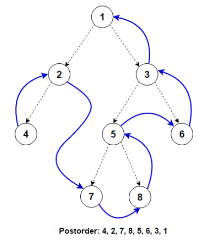
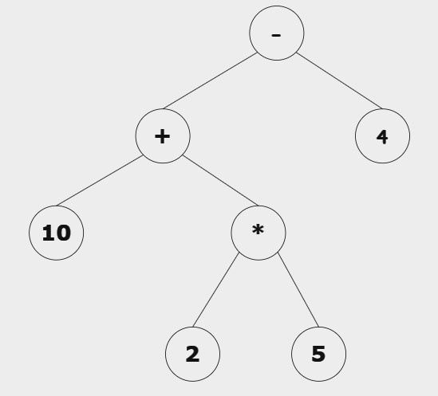
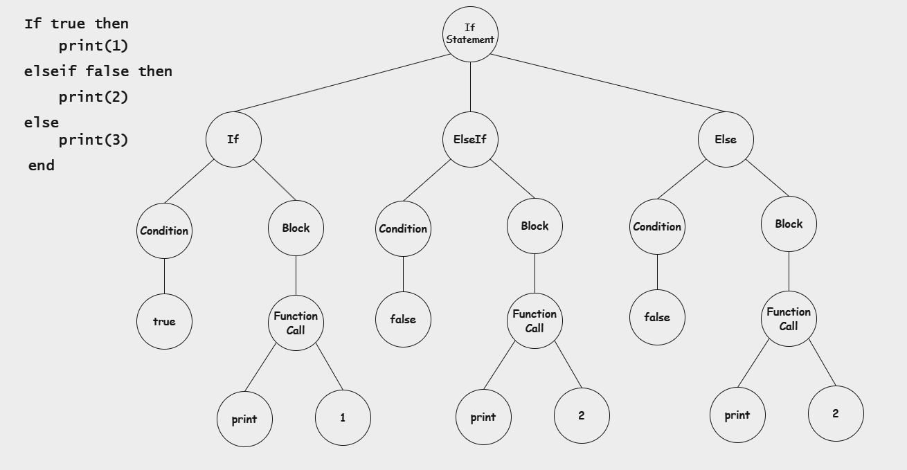

<!-- _class: topic -->
# Interpreters - Parsing
#### Khai-Yiu Soh

---
### Overview

+ Introduction to parsing
+ Building parser: Translation of rules to functions with hands-on

---
### Previously...

+ Created a lexer to generate a stream of tokens
+ Defined a set of syntax rules with CFG
+ Next: Perform syntax analysis and generate an AST

---
### Abstract Syntax Tree

+ Abstract representation of our code
+ Remove syntax details of a language
+ Nodes contain relevant information of the node type
+ Report syntax errors, semantic analysis, optimisation, execution

<!-- Provide syntax error messages. Scoping and variable typing. Optimisation. Direct execution through tree traversal -->
---
### Consider the following

+ Both functionally equivalent
+ Only care about block type, condition and body

```JavaScript
if (true) {
    console.log('Hello, World!')
}
```
```JavaScript
if (true) console.log('Hello, World!')
```

<!-- Concise form for single statements. Only important components are the condition, statements and in this case, the type of block -->
---
### Recursive Descent Parser

+ Simple implementation
+ Top down parser
+ Construct AST from outer to inner grammar rules

```
chunk     --> block ;
block     --> (statement)* returnStatement?
statement --> ...
```

---
<style scoped>
  .table {
    text-align: left;
  }
</style>
### How to implement

+ Translate grammar rules into code
+ Each rule becomes a function

<div class="table">

| Grammar      | Code translation             | Explanation                    |
| ------------ | ---------------------------- | ------------------------------ |
| Terminal     | Match and consume the token  | Basic building block           |
| Non-terminal | Call the rule's function     | Create a sub-expression        |
| \|           | If or switch statement       | Consider different cases       |
| *            | Loop                         | Repetition of clause           |
| ?            | If statement                 | Binary case, exists or doesn't |
</div>

---
### Example of translation

+ Each rule becomes a function

```
returnStatement --> 'return' expressionList ;
```
```JavaScript
1  function returnStatement() {
2
3  }
```
---
### Translation of terminal

+ Match and consume the token

```
returnStatement --> 'return' expressionList ;
```
```JavaScript
1  function returnStatement() {
2      ...
3  
4      consume('RETURN')
5  
6      ...
7  }
```
---
### Translation of non-terminal

+ Call the rule's function

```
returnStatement --> 'return' expressionList ;
```
```JavaScript
1  function returnStatement() {
2      ...
3  
4      consume('RETURN')
5      expressionList()
6  
7      ...
8  }
```
---
<style scoped>
  code {
    font-size: 20px;
  }
</style>
### Translation of | (pt. 1)

+ If or switch statement to handle cases

```
statement --> 'if' expression 'then' block 
              ('elseif' expression 'then' block)*
              ('else' block)? 
              'end' |

              'while' expression 'do' block 'end' |
              
              'repeat' block 'until' expression |

              'for' identifier '=' expression ',' expression
              (',' expression)?
              'do' block 'end' |

              'for' identifierList 'in' expressionList 'do' block 'end' |

              'function' functionName body |

              'local function' identifier body ;
```
---
### Translation of | (pt. 2)

```JavaScript
1   function statement() {
2       switch(tokenType) {
3           case 'IF': ...
4           case 'FOR': ...
5           case 'WHILE': ...
6           case 'REPEAT': ...
7           case 'FUNCTION': ...
8           ...
9       }
10  }
```
---
### Translation of *

+ Loop to handle repetition

```
expressionList --> expression (',' expression)* ;
```
```JavaScript
1  function expressionList() {
2      ...
3  
4      do
5          expression()
6      while (match('COMMA'))
7  
8      ...
9  }
```
---
### Translation of ?

+ If statement to handle optional case

```
block --> (statement)* returnStatement? ;
```
```JavaScript
1  function block() {
2      ...
3  
4      if (check('RETURN')) {
5          returnStatement()
6      }
7  
8      ...
9  }
```
---
### How does the parser work?

+ Iterate over a stream of tokens
+ Construct a type of node based off matching token
+ Helper functions  
+ **isAtEnd**, **advance**, **previous**, **match**, **peek**, **check**, **consume**

<!-- Lexer: iterate over source code -->
---
### Example output

+ Input: `10 + 2 - 4`


---
### Parser constructor

```JavaScript
class Parser {
    constructor(tokens) {
        this.tokens = tokens
        this.current = 0
    }
}
```
---
### isAtEnd & peek

```JavaScript
isAtEnd() {
    return peek().type === 'EOF'
}
```
```JavaScript
peek() {
    return tokens[current]
}
```
---
### advance & previous

```JavaScript
advance() {
    if (isAtEnd()) current++

    return previous()
}
```
```JavaScript
previous() {
    return tokens[current - 1]
}
```
---
### check

```JavaScript
check(tokenType) {
    if (isAtEnd()) return false

    return peek().type === tokenType
}
```
---
<style scoped>
  code {
    font-size: 20px;
  }
</style>
### match & consume

```JavaScript
1   match(...tokenTypes) {
2       for (let type of tokenType) {
3           if (check(type)) {
4               advance()
5
6               return true
7           }
8       }
9 
10      return false
11  }
```
```JavaScript
1  consume(tokenType, errorMessage) {
2      if (check(tokenType)) return advance()
3  
4     throw new Error(`Line ${peek().line}: ${message}`)
5  }
``` 
---
### Expressions

* Binary expressions and unary expressions
* Each node created has at most two branches
* Rules defined with CFG already handle precedence and associativity

---
<style scoped>
  img {
    margin-right: 80px;
  }
</style>
### Evaluation

<div class="container">

+ Post-order traversal
+ Visit children nodes first
+ Left -> Right -> Current


</div>

---
### Node example

+ Left / right can reference leaf nodes or a sub-branch
+ Leaf nodes are literal values
+ Sub-branch indicates sub-expressions

```JavaScript
{
    type: "BinaryExpression",
    left: ... ,
    operator: "+",
    right: ...
}
```
---
### Top level expression function

+ `expression --> logicalOr ;`

```JavaScript
expression() {
    return logicalOr()
}
```
---
<style scoped>
  code {
    font-size: 25px;
  }
</style>
### Brief preview into other functions

```
logicalOr     --> logicalAnd ("or" logicalAnd)* ;
logicalAnd    --> comparison ("and" comparison)* ;
comparison    --> bitwiseOr (( "==" | "~=" | ">" | ">=" | "<" | "<=" ) bitwiseOr)* ;
bitwiseOr     --> bitwiseXor ( "|" bitwiseXor )* ;
bitwiseXor    --> bitwiseAnd ( "~" bitwiseAnd )* ;
bitwiseAnd    --> shift ( "&" shift )* ;
shift         --> concatenation (( "<<" | ">>" ) concatenation)* ;
concatenation --> term ( ".." concatenation )* ;
```

```JavaScript
logicalOr() { const node = logicalAnd(); ... }
logicalAnd() { const node = comparison(); ... }
comparison() { const node = bitwiseOr(); ... }
bitwiseOr() { const node = bitwiseXor(); ... }
bitwiseXor() { const node = bitwiseAnd(); ... }
bitwiseAnd() { const node = shift(); ... }
shift() { const node = concatenation(); ... }
concatenation() { const node = term(); ... }
```

<!-- Next two rules are term (add/subtract) and factor (multi/division) -->
---
### term function

+ ```term --> factor (( "+" | "-" ) factor)* ;```

```JavaScript
1   term() {
2       let node = factor()
3   
4       while (match('PLUS, MINUS')) {
5           const operator = previous().lexeme
6           const right = factor()
7           node = { type: 'BinaryExpression', left: node, operator, right }
8       }
9   
10      return node
11  }
```
---
### factor function

+ ```factor --> unary (( "*" | "/" | "//" | "%" ) unary)* ;```

```JavaScript
1   factor() {
2       let node = unary()
3   
4       while (match('STAR', 'SLASH', 'DOUBLE_SLASH', 'PERCENT')) {
5           const operator = previous().lexeme
6           const right = unary()
7           node = { type: 'BinaryExpression', left: node, operator, right }
8       }
9   
10      return node
11  }
```
---
<style scoped>
  .code-block-normal {
    font-size: 26px;
  }
</style>
### primary function

+ `primary --> number | string | "true" | "false" | "nil" | "..." | functionDef | table | prefixExpression ;`
  
<div class="code-block-normal">

```JavaScript
1   primary() {
2       if (match('NUMBER', 'STRING', 'TRUE', 'FALSE', 'NIL')) {
3           return { type: 'Literal', value: previous().value }
4       }
5  
6       if (match('ELLIPSIS')) {
7           return { type: 'VarArgs' }
8       }
9  
10      if (check('FUNCTION')) {
11          return functionDef()
12      }
13  
14      if (check('LEFT_BRACE')) {
15          return table()
16      }
17  
18      return prefixExpression()
19  }
```
</div>

---
### Walkthrough example

+ Consider the expression: `10 + 2 * 5 - 4` 
+ Top level ```expression()``` called
+ Subsequent functions are called: ```logicalOr --> logicalAnd --> ... --> term```

```JavaScript
lowerPrecedenceFunction() {
    const node = nextPrecedenceFunction()
    ...
}
```
---
<style scoped>
  .code-block-normal {
    font-size: 30px;
  }
</style>
### Current token: 10

+ More subsequent calls until ```primary()```, hit a base case
+ ```factor()``` --> ```unary()``` --> ```power()``` --> ```primary()```

<div class="container">
<div class="code-block-normal">

```JavaScript
term() {
    const node = factor()
    ...
}
```
</div>
<div class="code-block-normal">

```JavaScript
factor() {
    const node = unary()
    ...
}
```
</div>
</div>

```JavaScript
primary() {
    if (match('NUMBER', ...)) {
        return { type: 'Literal', value: previous().value }
    }
    ...
}
```
---
### Current node value (outer node)

```JavaScript
{
    type: 'Literal',
    value: 10
}
```
---
### Current token: +

+ Return to ```term()``` from call stack

```JavaScript
1   term() {
2       let node = factor() // Finished, set result to node
3   
4       while (match('PLUS, MINUS')) {  // Current token matches, consume
5           const operator = previous().lexeme  // +
6           const right = factor()  // Next step
7           node = { type: 'BinaryExpression', left: node, operator, right }
8       }
9   
10      return node
11  }
```
---
### Current token: 2

+ Similar to first step, hit a base case in ```primary()```
+ ```factor()``` --> ```unary()``` --> ```power()``` --> ```primary()```

```JavaScript
{
    type: 'Literal',
    value: 2
}
```
---
### Current token: *

+ Return to ```factor()``` from call stack

```JavaScript
1   factor() {
2       let node = unary() // Finished, set result to node
3   
4       while (match('STAR', 'SLASH', 'DOUBLE_SLASH', 'PERCENT')) { // Matches
5           const operator = previous().lexeme  // * 
6           const right = unary() // Next step
7           node = { type: 'BinaryExpression', left: node, operator, right }
8       }
9   
10      return node
11  }
```
---
### Current token: 5

+ Hit a base case in ```primary()```
+ ```factor()``` --> ```unary()``` --> ```power()``` --> ```primary()```
+ Set ```right``` to the result

```JavaScript
{
    type: 'Literal',
    value: 5
}
```
---
### Current node value (inner node)

```JavaScript
node = { type: 'BinaryExpression', left: node, operator, right }
```
```JavaScript
{
    type: 'BinaryExpression',
    left: {
        type: 'Literal',
        value: 2
    },
    operator: '*',
    right: {
        type: 'Literal',
        value: 5
    }
}
```
---
### Current token: -

+ No more matches, return back to ```term()``` with result

```JavaScript
1   factor() {
2       let node = unary() 
3   
4       while (match('STAR', 'SLASH', 'DOUBLE_SLASH', 'PERCENT')) { // No match
5           const operator = previous().lexeme 
6           const right = unary() 
7           node = { type: 'BinaryExpression', left: node, operator, right } // New node
8       }
9   
10      return node // Return new node
11  }
```
---
### Back to initial call

```JavaScript
1   term() {
2       let node = factor() 
3   
4       while (match('PLUS, MINUS')) {
5           const operator = previous().lexeme
6           const right = factor()  // Set to new node
7           node = { type: 'BinaryExpression', left: node, operator, right }
8       }
9   
10      return node
11  }
```
---
<style scoped>
  code {
    font-size: 23px;
  }
</style>
### Current node value (outer node)

```JavaScript
{
    type: 'BinaryExpression',
    left: {
        type: 'Literal',
        value: 10
    },
    operator: '+',
    right: {
        type: 'BinaryExpression',
        left: {
            type: 'Literal',
            value: 2
        },
        operator: '*',
        right: {
            type: 'Literal',
            value: 5
        }
    }
}
```

---
### Current node value

```JavaScript
node = { type: 'BinaryExpression', left: node, operator, right }
```
```JavaScript
{
    type: 'BinaryExpression',
    left: {
        type: 'Literal',
        value: 10
    },
    operator: '+',
    right: {
        type: 'Literal',
        value: 2
    }
}
```
---
### Current token: -

```JavaScript
1   term() {
2       let node = factor() 
3   
4       while (match('PLUS, MINUS')) {  // Matches, consume
5           const operator = previous().lexeme  // -
6           const right = factor()  // Next step
7           node = { type: 'BinaryExpression', left: node, operator, right }
8       }
9   
10      return node
11  }
```
---
### Current token: 4

+ Hit a base case in ```primary()```
+ ```factor()``` --> ```unary()``` --> ```power()``` --> ```primary()```
+ Set ```right``` to the result

```JavaScript
{
    type: 'Literal',
    value: 4
}
```
---
### No more tokens

```JavaScript
1   term() {
2       let node = factor() 
3   
4       while (match('PLUS, MINUS')) { 
5           const operator = previous().lexeme  
6           const right = factor()  // Set to new node
7           node = { type: 'BinaryExpression', left: node, operator, right }
8       }
9   
10      return node
11  }
```
---
<style scoped>
  code {
    font-size: 40px;
    margin-bottom: 60px;
  }
</style>
### Final node value (outer node)

```JavaScript
{
    type: 'BinaryExpression',
    left: {
        type: 'BinaryExpression',
        left: {
            type: 'Literal',
            value: 10
        },
        operator: '+',
        right: {
            type: 'BinaryExpression',
            left: {
                type: 'Literal',
                value: 2
            },
            operator: '*',
            right: {
                type: 'Literal',
                value: 5
            }
        }
    },
    operator: '-',
    right: {
        type: 'Literal',
        value: 4
    }
}
```
---
### AST from walkthrough



---
### Hands-on

+ Attempt the implementation for **unary**
+ `unary --> ( "-" | "not" | "#" | "~" ) unary | power ;`
+ Additional information:
  
  + Token names are "MINUS", "NOT", "HASHTAG" and "TILDA" respectively
  + Token structure consists of properties: type, lexeme, value, line
---
### Implementation for unary

+ `unary --> ( "-" | "not" | "#" | "~" ) unary | power ;`

```JavaScript
unary() {
    if (match('MINUS', 'NOT', 'HASHTAG', 'TILDA')) {
        const operator = previous().lexeme
        const right = unary()

        return { type: 'UnaryExpression', operator, right }
    }

    return power()
}
```
---
### Statements

+ Statements represent higher level constructs
+ Information differs between types of statements
+ Ex. For statement: ```variable```, ```initial```, ```final```, ```step```, ```body```
+ Ex. Assignment: ```variableList```, ```expressionList```
+ Ex. If statement: ```clauses``` containing ```type```, ```condition```, ```body```

<!-- Represent higher level constructs like loops, assignments, conditions. Don't fit the binary operations where you need to know the right and left operands -->
---
<style scoped>
  code {
    font-size: 20px;
  }
</style>
### Block

+ block --> (statement)* returnStatement? ;

```JavaScript
1   block() {
2       const node = { type: 'Block', statememts: [] }
4  
5       while (!check('RETURN') && !check('END') &&
6              !check('ELSEIF') && !check('ELSE') &&
7              !check('UNTIL') && !isAtEnd()) 
8       {
9           node.statements.push(statement())
10          match('SEMICOLON')
11      }
12  
13      if (check('RETURN')) {
14          node.returnStatement = returnStatement()
15      }
16  
17      return node
18  }
```

---
### If Statement

```
'if' expression 'then' block 
('elseif' expression 'then' block)*
('else' block)? 
'end'
```

+ Always **if** block
+ Could be multiple **elseif** blocks
+ Might be one **else** block

---
### If Statement (pt. 1)

+ Create node with necessary information
+ Skip the **if** token first

```JavaScript
ifStatement() {
    const node = { type: 'IfStatement', clauses: [] }
    advance()

    ...

    consume('END', 'Expected "end" after "if" statement.')
    return node
}
```
---
### Components (pt. 2)

```JavaScript
ifStatement() {
    ...

    node.clauses.push(ifBlock());

    if (check('ELSEIF')) {
        node.clauses.push(...elseIfBlock());
    }

    if (check('ELSE')) {
        node.clauses.push(elseBlock());
    }

    ...
}
```
---
<style scoped>
  code {
    font-size: 25px;
  }
</style>
### ifBlock (pt. 3)

+ 'if' expression 'then' block

```JavaScript
ifBlock() {
    const clause = { type: 'IfClause' }

    if (match('LEFT_PAREN')) {
        clause.condition = expression()
        consume('RIGHT_PAREN', 'Expected ")" after "if" condition.')
    } else {
        clause.condition = expression()
    }

    consume('THEN', 'Expected "then" after "if" condition.')
    clause.block = block()

    return clause
}
```

<!-- Parentheses around condition are optional. Explicit check is more efficient, explicit error message, not a grouping expression in this context -->
---
<style scoped>
  code {
    font-size: 18px;
  }
</style>
### elseIfBlock (pt. 4)

+ ('elseif' expression 'then' block)*

```JavaScript
elseIfBlock() {
    const clauses = [];

    while (match('ELSEIF')) {
        const clause = { type: 'ElseIfClause' }

        if (match('LEFT_PAREN')) {
            clause.condition = expression()
            consume('RIGHT_PAREN', 'Expected ")" after "elseif" condition.')
        } else {
            clause.condition = expression()
        }

        consume('THEN', 'Expected "then" after  "elseif" condition.')
        clause.block = block()

        clauses.push(clause)
    }

    return clauses
}
```
---
### elseBlock (pt. 5)

+ ('else' block)?

```JavaScript
elseBlock() {
    const clause = { type: 'ElseClause' }
    
    advance()
    clause.block = block()
    
    return clause
}
```
---
### Example with if statement



---
### Thanks for listening