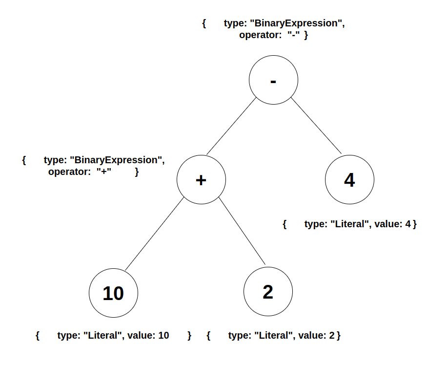
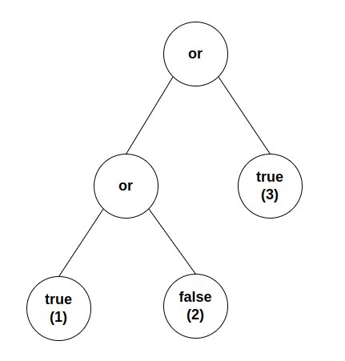

<!-- _class: topic -->
# Interpreters - Parsing
#### Khai-Yiu Soh

---
### Overview

+ Introduction to Parsing
+ Building AST for Lua

---
### Previously...

+ Created a lexer to generate a stream of tokens
+ Defined a set of syntax rules with CFG
+ Next: Perform syntax analysis and generate an AST

---
### Abstract Syntax Tree

+ Abstract representation of our code
+ Each node contains metadata

  + Type
  + Information relevant to the node type
+ Report syntax errors

<!-- Can edit or add information to elements in an AST, ex. providing useful error messages by storing line or column number -->

---
### Recursive Descent Parser

+ Simple implementation
+ Top down parser
+ Constructing from outer to inner grammar rules

```
chunk     --> block ;
block     --> (statement)* returnStatement?
statement --> ...
```

---
<style scoped>
  .table {
    text-align: left;
  }
</style>
### How to implement

+ Translate grammar rules into code
+ Each rule becomes a function

<div class="table">

| Grammar      | Code translation             | Explanation                    |
| ------------ | ---------------------------- | ------------------------------ |
| Terminal     | Match and consume the token  | Basic building block           |
| Non-terminal | Call the rule's function     | Create a sub-expression        |
| \|           | If or switch statement       | Consider different cases       |
| *            | Loop                         | Repetition of clause           |
| ?            | If statement                 | Binary case, exists or doesn't |
</div>

---
### Example of translation

+ Each rule becomes a function

```
returnStatement --> 'return' expressionList ;
```
```JavaScript
1  function returnStatement() {
2
3  }
```
---
### Translation of terminal

+ Match and consume the token

```
returnStatement --> 'return' expressionList ;
```
```JavaScript
1  function returnStatement() {
2      ...
3  
4      consume('RETURN')
5  
6      ...
7  }
```
---
### Translation of non-terminal

+ Call the rule's function

```
returnStatement --> 'return' expressionList ;
```
```JavaScript
1  function returnStatement() {
2      ...
3  
4      consume('RETURN')
5      const expressions = expressionList()
6  
7      ...
8  }
```
---
<style scoped>
  code {
    font-size: 20px;
  }
</style>
### Translation of | (pt. 1)

+ If or switch statement to handle cases

```
statement --> 'if' expression 'then' block 
              ('elseif' expression 'then' block)*
              ('else' block)? 
              'end' |

              'while' expression 'do' block 'end' |
              
              'repeat' block 'until' expression |

              'for' identifier '=' expression ',' expression
              (',' expression)?
              'do' block 'end' |

              'for' identifierList 'in' expressionList 'do' block 'end' |

              'function' functionName body |

              'local function' identifier body ;
```
---
### Translation of | (pt. 2)

```JavaScript
1   function statement() {
2       switch(tokenType) {
3           case 'IF': ...
4           case 'FOR': ...
5           case 'WHILE': ...
6           case 'REPEAT': ...
7           case 'FUNCTION': ...
8           ...
9       }
10  }
```
---
### Translation of *

+ Loop to handle repetition

```
expressionList --> expression (',' expression)* ;
```
```JavaScript
1  function expressionList() {
2      ...
3  
4      do
5          ...
6      while (match('COMMA'))
7  
8      ...
9  }
```
---
### Translation of ?

+ If statement to handle optional case

```
block --> (statement)* returnStatement? ;
```
```JavaScript
1  function expressionList() {
2      ...
3  
4      if (check('RETURN')) {
5          const returnStatement = returnStatement()
6      }
7  
8      ...
9  }
```
---
### How does the parser work?

+ Iterate over a stream of tokens
+ Construct a type of node based off matching token
+ Helper functions  
+ **isAtEnd**, **advance**, **previous**, **match**, **peek**, **check**, **checkNext**, **consume**

<!-- Lexer: iterate over source code -->
---
### Example output

+ Input: `10 + 2 - 4`


---
### Parser constructor

```JavaScript
class Parser {
    constructor(tokens) {
        this.tokens = tokens
        this.current = 0
    }
}
```
---
### isAtEnd & peek

```JavaScript
isAtEnd() {
    return peek().type === 'EOF'
}
```
```JavaScript
peek() {
    return tokens[current]
}
```
---
### advance & previous

```JavaScript
advance() {
    if (isAtEnd()) current++

    return previous()
}
```
```JavaScript
previous() {
    return tokens[current - 1]
}
```
---
### check & checkNext

```JavaScript
check(tokenType) {
    if (isAtEnd()) return false

    return peek().type === tokenType
}
```
```JavaScript
checkNext(tokenType) {
    if (current + 1 < tokens.length && tokens[current + 1] !== 'EOF') return false

    return tokens[current + 1].type === tokenType
}
```
---
<style scoped>
  code {
    font-size: 20px;
  }
</style>
### match & consume

```JavaScript
1  match(...tokenTypes) {
2      for (let type of tokenType) {
3          if (check(type)) advance()
4
5          return true
6  }
7
8   return false
9  }
```
```JavaScript
1  consume(tokenType, errorMessage) {
2      if (check(tokenType)) return advance()
3  
4    throw new Error(`Line ${peek().line}: ${message}`)
}
``` 
---
### Expressions

* Binary expressions and unary expressions
* Each node created has at most two branches
* Rules defined with CFG already handle precedence and associativity

---
### Node example

+ Left / right can reference leaf nodes or a sub-branch
+ Leaf nodes are literal values
+ Sub-branch indicates sub-expressions

```JavaScript
{
    type: "BinaryExpression",
    left: ... ,
    operator: "+",
    right: ...
}
```
---
### Top level expression function

+ `expression --> logicalOr ;`

```JavaScript
expression() {
    return logicalOr()
}
```
---
### logicalOr function

+ `logicalOr --> logicalAnd ("or" logicalAnd)* ;`

```JavaScript
1   logicalOr() {
2       let node = logicalAnd();
3   
4       while (this.match('OR')) {
5           const operator = previous().lexeme;
6           const right = logicalAnd();
7           node = { type: 'BinaryExpression', left: node, operator, right };
8       }
9   
10      return node;
11  }
```
---
### Primary function

+ `primary --> number | string | "true" | "false" | "nil" | "..." | functionDef | table | prefixExpression ;`
  
```JavaScript
1   primary() {
2       if (this.match('NUMBER', 'STRING', 'TRUE', 'FALSE', 'NIL')) {
3           return { type: 'Literal', value: this.previous().value };
4       }
5  
6       if (this.match('ELLIPSIS')) {
7           return { type: 'VarArgs' };
8       }
9  
10      if (this.check('FUNCTION')) {
11          return this.functionDef();
12      }
13  
14      if (this.check('LEFT_BRACE')) {
15          return this.table();
16      }
17  
18      return this.prefixExpression();
19  }
```
---
### Example of nested node (pt. 1)

+ Consider the expression: `true or false or true` 
+ First **logicalAnd** call returns `{ type: 'Literal', value: true }`
+ Loop condition is met, consuming an **OR** token
+ Second **logicalAnd** call returns same as first call but assigned to the right

---
### Example of nested node (pt. 2)

```JavaScript
node = { type: 'BinaryExpression', left: node, operator, right };
```

+ Set the left branch to the currently built-up node construct
+ Essentially creating a parent node
+ The loop repeats, consuming the last **OR** token
+ Third **logicalAnd** call returns same as first call and assigned to the right
+ Note: The first node is now nested

<!-- The inner-most nodes are evaluated first which are also the nodes constructed first. Makes sense for a left-associative operation such as "or" -->

---
### Example of nested node (pt. 3)



---
### Hands-on

+ Attempt the implementation for **unary**
+ `unary --> ( "-" | "not" | "#" | "~" ) unary | power ;`
+ Additional information:
  
  + Token names are "MINUS", "NOT", "HASHTAG" and "TILDA" respectively
  + Token structure consists of properties: type, lexeme, value, line
---
### Implementation for unary

```JavaScript
unary() {
    if (match('MINUS', 'NOT', 'HASHTAG', 'TILDA')) {
        const operator = previous().lexeme
        const right = unary()

        return { type: 'UnaryExpression', operator, right }
    }
}
```
---
### Statements

---
### Evaluation