<!-- _class: topic -->
# Introduction to React Hooks
#### Khai-Yiu Soh

---
#### About React

- React is a JavaScript library
- Developed in 2011 by Jordan Walke
- Create dynamic user interfaces through reusable components
- Still popular for large scale applications, maintainable and scalable
- Plenty of libraries and tools developed by a thriving community

---
#### Timeline

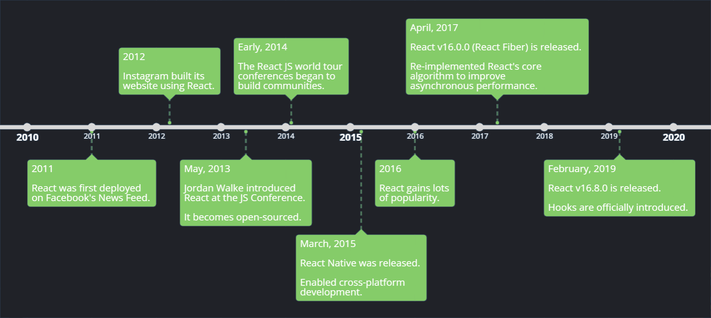

---
#### What are hooks?

- Traditionally, components were built using classes
- React hooks are functions that can manage state and lifecycle features of functional components
- Hooks should be called at the top level
- Cannot be called in conditions, loops or nested functions

---
<style scoped>
  ul { 
    columns: 2 },
  li { 
    font-size: 35px;
    margin-bottom: 30px;
  }
</style>

#### Built-in Hooks

- useState
- useEffect
- useRef
- useContext
- useReducer
- useMemo
- useCallback
- Custom Hooks?

---
#### Why should we use hooks?

- Future development is focused on hooks
- Extract and reuse stateful logic across components
- Functional components are smaller, less verbose syntax
- No repeated logic across lifecycle methods
- More readable, easier to maintain

---
<!-- _class: topic -->
# useState

---
<style scoped>
  code {
    font-size: 30px;
  }
</style>
#### What is useState?
##### A hook to manage state in functional components

```JSX
import { useState } from "react";

function Component() {
  const [state, setState] = useState(initialState);

  return ...
}
```

---
#### Managing state

- Parameters:

  - `initialState`

- Returns:

  - The current `state`
  - A `set` function to update the state

- `state` is set to `initialState` ONLY on the first render
- `set` can accept a new state or a function to calculate from previous state

---
<style scoped>
  ul {
    flex: 1;
    margin-right: 20px;
    font-size: 25px;
  }
</style>

#### State with Class Components

<div class="container">

- Constructor initialises state and bind functions to the component
- `this.state` is an object
- Update state with `this.setState`
- Verbose syntax with `this`

<div class="code-block-normal">

```JSX
class Counter extends React.Component {
  constructor() {
    super();
    this.state = {
      count: 0
    };

    this.handleIncrement = this.handleIncrement.bind(this);
  }

  handleIncrement() {
    this.setState(prevState => ({ count: prevState.count + 1 }));
  }

  render() {
    return (
      <section>
        <h1>{this.state.count}</h1>
        <button onClick={this.handleIncrement}>Increment</button>
      </section>
    );
  }
}
```
</div>
</div>

---
<style scoped>
  ul {
    flex: 1;
    margin-right: 20px;
    font-size: 25px;
  }
</style>

#### State with Functional Components

<div class="container">

- Less code, more readable
- State can be primitive data
- Don't need to worry about `this`
- No binding in functions

<div class="code-block-normal">

```JSX
function Counter() {
  const [count, setCount] = useState(0);

  const handleIncrement = () => {
    setCount(prevCount => prevCount + 1);
  }

  return (
    <section>
      <h1>{count}</h1>
      <button onClick={handleIncrement}>Increment</button>
    </section>
  )
}
```
</div>
</div>

---
#### Counter Demo: Initial state

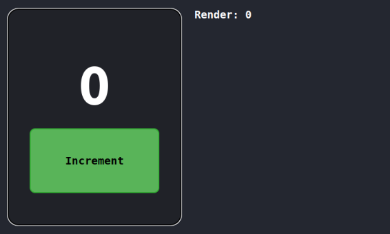 

---
#### Counter Demo: Click 1

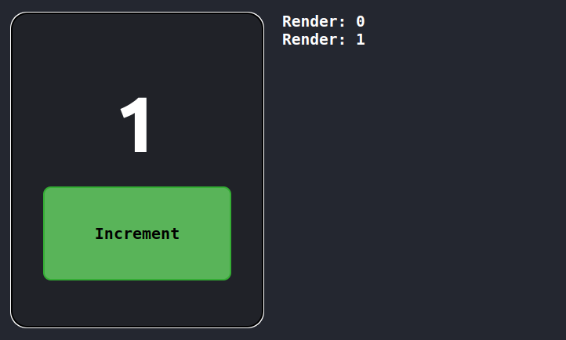 

---
#### Counter Demo: Click 2

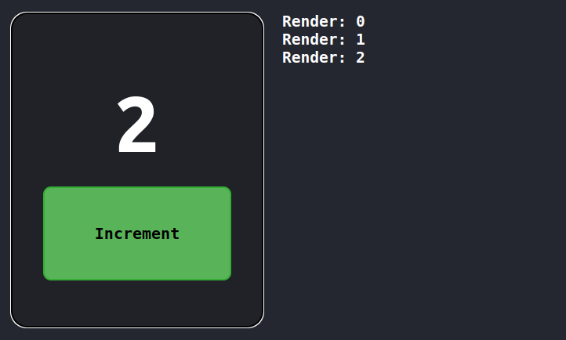 

---
<style scoped>
  code {
    font-size: 25px;
  }
</style>
#### Exercise

```JSX
function Counter() {
  const [count, setCount] = useState(0);

  const handleIncrement = () => {
    setCount(count + 1);
    setCount(count + 1);
  };

  return (
    <section>
      <h1>{count}</h1>
      <button onClick={handleIncrement}>Increment</button>
    </section>
  );
}
```
---
#### Exercise Demo: Initial state

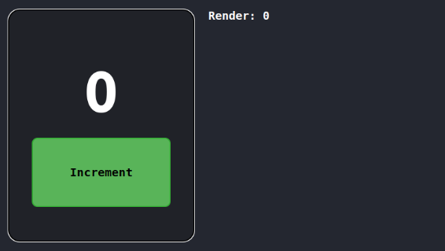 

---
#### Exercise Demo: Click 1
###### `count` is still 0 after invoking `setCount`?

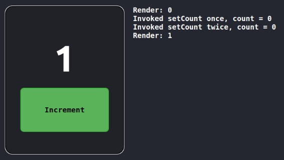 

---
#### Snapshot

- Snapshot state after render
- During first render, `count` is fixed to 0
- `setCount` is set two times to 1
- State updates are processed after event handler finishes

```JSX
const [count, setCount] = useState(0);

const handleIncrement = () => {
  setCount(count + 1);  // count = 0 + 1
  setCount(count + 1);  // count = 0 + 1
};
```

---
#### Batching

- Queue state updates until the end
- Prevent triggering too many renders
- Stores the most recent calculated state
- Only the state of the most recent call is processed

```JSX
const [count, setCount] = useState(0);

const handleIncrement = () => {
  setCount(count + 1);                    // count = 0 + 1
  setCount(prevCount => prevCount + 3);   // count = 1 + 3
  setCount(50);                           // count = 50
};
```

---
<style scoped>
  code {
    font-size: 25px;
  }
</style>

#### Solution

```JSX
function Counter() {
  const [count, setCount] = useState(0);

  const handleIncrement = () => {
    setCount(prevCount => prevCount + 1); // count = 0 + 1
    setCount(prevCount => prevCount + 1); // count = 1 + 1
  };

  return (
    <section>
      <h1>{count}</h1>
      <button onClick={handleIncrement}>Increment</button>
    </section>
  );
}
```

---
<!-- _class: topic -->
# useEffect

---
<style scoped>
  code {
    font-size: 30px;
  }
</style>

#### What is useEffect?
##### A hook to manage side effects in functional components

```JSX
import { useEffect } from "react";

function Component() {
  useEffect.(callbackFunction, dependencyArray?);

  return ...
}
```

---
#### Side effects

- Generally, functions have side effects if it does anything but take input and return an output
- In React, a component should only take props and state to return a description of the UI
- Include DOM manipulation, API calls, subscriptions, or anything external...

---
#### Managing side effects

- Parameters:

  - `setup` function that optionally returns a `cleanup` function
  - _optional:_ `dependency` array containing reactive values within `setup`

- Returns:

  - `undefined`

- Run `setup` if a value in the `dependency` changes
- `cleanup` runs after re-render before `setup` runs

---
<style scoped>
  ul {
    flex: 1;
    margin-right: 20px;
    font-size: 25px;
  }
  .code-block-small {
    flex: 1;
    margin-top: -50px;
    font-size: 5em;
    padding: 0.2em;
  }
</style>

##### Side Effects with Class Components

<div class="container">

- Many types of lifecycle methods
- `componentDidMount`
- `componentDidUpdate`
- `componentWillUnmount`
- Need to check if props/state updated
- Potential for duplicated code 

<div class="code-block-small">

```JSX
class Counter extends React.Component {
  constructor(props) {
    super(props);
    this.state = {
      count: 0
    };

    this.handleIncrement = this.handleIncrement.bind(this);
  }

  componentDidMount() {
    document.title = this.state.count;
  }

  componentDidUpdate(prevState) {
    if (prevState.count !== this.state.count) {
      document.title = this.state.count;
    }
  }

  handleIncrement() {
    this.setState(prevState => ({ count: prevState.count + 1 }));
  }

  render() {
    return (
      <section>
        <h1>{this.state.count}</h1>
        <button onClick={this.handleIncrement}>Increment</button>
      </section>
    );
  }
}
```
</div>
</div>

---
<style scoped>
  ul {
    flex: 1;
    margin-right: 20px;
    font-size: 25px;
  }
</style>

##### Side Effects with Functional Components

<div class="container">

- Less code with useEffect
- No more duplicated code
- Runs at least once on initial render, `componentDidMount`
- Dependency array mimics behaviour of `componentDidUpdate`
- Checks for changes internally
- Optional `cleanup` equivalent to `componentWillUnmount`

<div class="code-block-normal">

```JSX
function Counter() {
  const [count, setCount] = useState(0);

  useEffect(() => {
    document.title = count;
  }, [count]);

  const handleIncrement = () => {
    setCount(prevCount => prevCount + 1);
  };

  return (
    <section>
      <h1>{count}</h1>
      <button onClick={handleIncrement}>Increment</button>
    </section>
  );
}
```
</div>
</div>

---
#### Counter Demo: Initial state

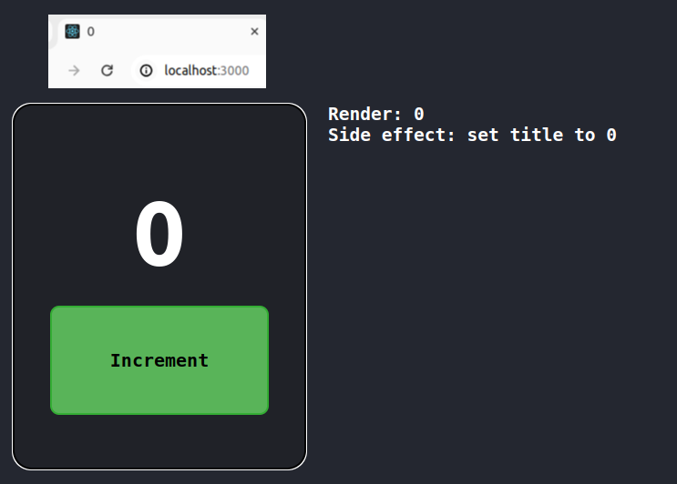 

---
#### Counter Demo: Click 1

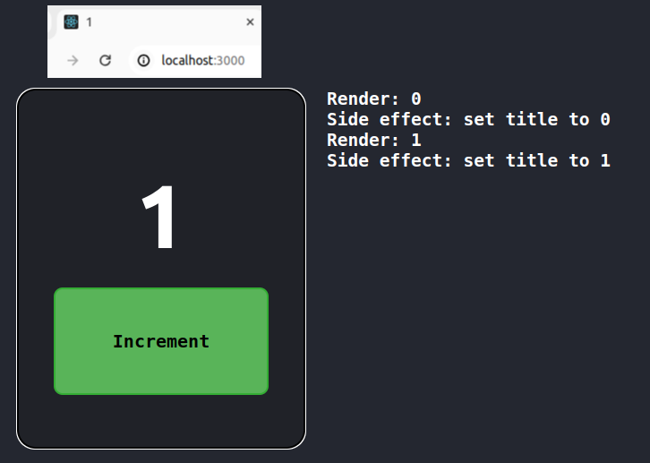

---
#### Counter Demo: Click 2

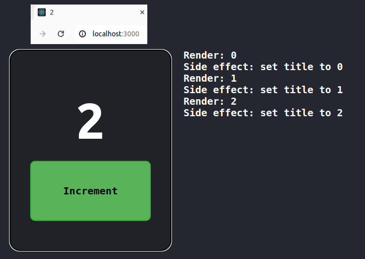

---
<style scoped> 
  code {
    font-size: 25px;
  }
</style>

#### Exercise

```JSX
function Counter() {
  const [count, setCount] = useState(0);

  useEffect(() => {
    document.title = count;
  }, []);

  const handleIncrement = () => {
    setCount(prevCount => prevCount + 1);
  };

  return (
    <section>
      <h1>{count}</h1>
      <button onClick={handleIncrement}>Increment</button>
    </section>
  );
}
```
---
#### Exercise Demo: Initial state

 

---
#### Exercise Demo: Click 1
###### Our side effect is not run!

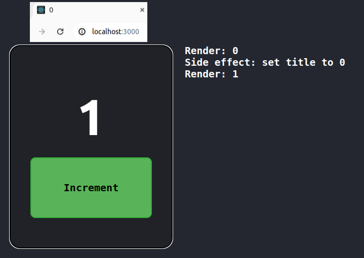

---
#### Dependencies

- No `dependency`: Runs after every render
- Empty `dependency`: Runs once after the initial render
- Non-empty `dependency`: Runs if variable changes value

---
#### Interval counter

- Setup event listeners or timed functions once on initial render
- Becareful of loops
 
<div class="container">
<div class="code-block-normal">

```JSX
const [count, setCount] = useState(0);

useEffect(() => {
  const id = setInterval(() => {
    setCount(count + 1);
  }, 1000);

  return () => {
    clearInterval(id);
  }
}, [count]);
```
</div>
<div class="code-block-normal">

```JSX
const [count, setCount] = useState(0);

useEffect(() => {
  const id = setInterval(() => {
    setCount(prevCount => prevCount + 1);
  }, 1000);

  return () => {
    clearInterval(id);
  }
}, []);
```
</div>
</div>

---
<style scoped>
  code {
    font-size: 24px;
  }
</style>

#### Fetch country population

- Fetch updates information when a dependent variable changes

```JSX
const [country, setCountry] = useState("Australia");
const [population, setPopulation] = useState(null);

useEffect(() => {
  // Declare fetch function
  const fetchPopulation = async () => {
    const url = "https://fakeURL/" + country;
    const response = await fetch(url);
    const countryPopulation = await response.json();

    setPopulation(countryPopulation);
  };

  // Invoke fetch function whenever useEffect runs
  fetchPopulation();
}, [country]);
```

---
<!-- _class: topic -->
# useRef

---
#### What is useRef?
##### A hook that lets you reference a value that's not needed for rendering

```JSX
import { useRef } from "react";

function Component() {
  const ref = useRef(initialValue);

  return ...
}
```

---
#### Managing references

- Parameters:
  - `initialValue`
- Returns:
  - An object with the mutable `current`  property
- `current` is set to `initialValue` ONLY on the first render
- Passing object to `ref` attribute of a JSX element will set its `current` property

---
<style scoped>
  ul {
    flex: 1;
    margin-right: 20px;
    font-size: 25px;
  }
  .code-block-small {
    flex: 1;
    margin-top: -60px;
    font-size: 5em;
    padding: 0.2em;
  }
</style>

#### References with Class Components

<div class="container">

- Call `createRef` in constructor
- Use `this` to access object
- Pass as `ref` to JSX for DOM tasks

<div class="code-block-small">

```JSX
class Counter extends React.Component {
  constructor() {
    super();
    this.state = {
      count: 0,
      timerRunning: false,
    };

    this.intervalRef = createRef(null);
    this.timerHandler = this.timerHandler.bind(this);
  }

  timerHandler() {
    if (this.state.timerRunning) {
      clearInterval(this.intervalRef.current);
    } else {
      this.intervalRef.current = setInterval(() => {
        this.setState({ count: this.state.count + 1 });
      }, 1000);
    }

    this.setState({ timerRunning: !this.state.timerRunning });
  }

  render() {
    return (
      <section>
        <h1>{this.state.count}</h1>
        <button onClick={this.timerHandler}>
          {this.state.timerRunning ? "Stop" : "Start"}
        </button>
      </section>
    );
  }
}
```
</div>
</div>


---
<style scoped>
  ul {
    flex: 1;
    margin-right: 20px;
    font-size: 25px;
  }
  .code-block-small {
    flex: 1;
    margin-top: -80px;
    font-size: 6em;
    padding: 0.2em;
  }
</style>
#### References with Functional Components

<div class="container">

- Initialisation same as `useState`
- No more `this`
- Access to DOM same as class components

<div class="code-block-small">

```JSX
function Counter() {
  const [count, setCount] = useState(0);
  const [timerRunning, setTimerRunning] = useState(false);
  const intervalRef = useRef(null);

  const timerHandler = () => {
    if (timerRunning) {
      clearInterval(intervalRef.current);
    }
    else {
      intervalRef.current = setInterval(() => {
        setCount(prevCount => prevCount + 1);
      }, 1000);
    }

    setTimerRunning(prevTimerRunning => !prevTimerRunning);
  }

  return (
    <section>
      <h1>{count}</h1>
      <button onClick={timerHandler}>
        {timerRunning ? "Stop" : "Start"}
      </button>
    </section>
  );
}
```
</div>
</div>

---
<style>
  video {
    width: 400px;
    height: 550px;
    align-self: center;
  }
  video::-webkit-media-controls {
    will-change: transform;
  }
</style>
#### Counter Demo

---
#### Exercise

```JSX
function Counter() {
  const countRef = useRef(0);

  const handleIncrement = () => {
    countRef.current = countRef.current + 1;
  };

  return (
    <section>
      <h1>{countRef.current}</h1>
      <button onClick={handleIncrement}>Increment</button>
    </section>
  );
}
```

----
#### Exercise Demo: Initial state

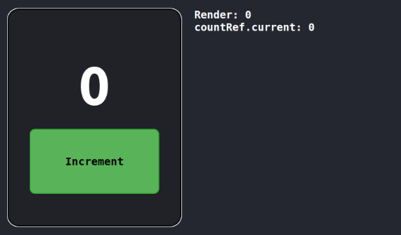 


---
#### Exercise Demo: Click 1
###### Mutating `ref.current` does not trigger render

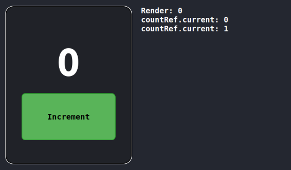

---
#### Manipulate the DOM

- Might need to update DOM node directly
- Call functions from the Browser API
- Includes focusing on a node, scroll node into view, measure dimensions

```JSX
const inputRef = useRef(null);

useEffect(() => {
  if (inputRef.current) {
    inputRef.current.focus();
  }
}, []);

return <input ref={inputRef} />
```

---
#### Other built-in hooks

- `useContext` pass data within component tree through global context
- `useMemo` cache value between re-renders
- `useCallback` cache functions between re-renders
- `useReducer` accumulate actions over time into state

---
<!-- _class: topic -->
# Custom Hooks

---
#### What are custom hooks?

- Not as complicated as it sounds
- Basically just functions which use other hooks
- Main purpose of sharing reusable non-visual logic between components
- Typically written in another file and exported to wherever the application needs it

---
#### Rules
#### 1. Custom hook names MUST begin with "use"
#### 2. MUST call at least one built-in hook

---
<style scoped>
  .code-block-small {
    flex: 1;
    margin-top: -80px;
    font-size: 7em;
    padding: 0.2em;
  }
</style>

#### Counter from useRef Demo

<div class='code-block-small'>

```JSX
function Counter() {
  const [count, setCount] = useState(0);
  const [timerRunning, setTimerRunning] = useState(false);
  const intervalRef = useRef(null);

  const timerHandler = () => {
    if (timerRunning) {
      clearInterval(intervalRef.current);
    }
    else {
      intervalRef.current = setInterval(() => {
        setCount(prevCount => prevCount + 1);
      }, 1000);
    }

    setTimerRunning(prevTimerRunning => !prevTimerRunning);
  }

  return (
    <section>
      <h1>{count}</h1>
      <button onClick={timerHandler}>
        {timerRunning ? "Stop" : "Start"}
      </button>
    </section>
  );
}
```
</div>

---
#### Extracting Counter and Timer

<div class="container">
<div class="code-block-normal">

```JSX
export function useCounter(initialCount) {
  const [count, setCount] = useState(initialCount);
  const incrementCount = () => {
    setCount(prevCount => prevCount + 1);
  };

  return [count, incrementCount];
}
```
</div>
<div class="code-block-normal">

```JSX
export function useTimer(callbackFn, delay) {
  const [timerRunning, setTimerRunning] = useState(false);
  const intervalRef = useRef(null);

  const timerHandler = () => {
    if (timerRunning) {
      clearInterval(intervalRef.current);
    } else {
      intervalRef.current = setInterval(callbackFn, delay);
    }

    setTimerRunning(prevTimerRunning => !prevTimerRunning);
  };

  return [timerRunning, timerHandler];
}
```
</div>
</div>

---
#### After Refactoring

```JSX
import { useCounter, useTimer } from "./file";

function Counter() {
  const [count, incrementCount] = useCounter(0);
  const [timerRunning, timerHandler] = useTimer(incrementCount, 1000);

  return (
    <section>
      <h1>{count}</h1>
      <button onClick={timerHandler}>{timerRunning ? "Stop" : "Start"}</button>
    </section>
  );
}
```

---
#### Reading material

- React's In-built hooks: 
https://react.dev/reference/react/hooks
- Browser API for DOM: 
https://developer.mozilla.org/en-US/docs/Web/API/Element